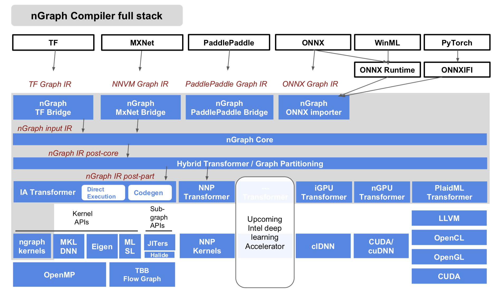

About nGraph Compiler stack
===========================

nGraph Compiler stack architecture
----------------------------------

The diagram below represents our current Beta release stack. Please note 
that the stack diagram is simplified to show how nGraph executes deep 
learning workloads with two hardware backends; however, many other 
deep learning frameworks and backends currently are functioning.

<alt="Simplified view of nGraph Compiler stack" width="733" />

Starting from the top of the diagram, we present a simplified view of 
how the nGraph Intermediate Representation (IR) can receive a graph
from a framework such as TensorFlow\* or MXNet\* when there is a 
corresponding "Bridge" or import method, such as from NNVM or via 
[ONNX](http://onnx.ai). Once the nGraph Core ops can begin 
parsing the graph as a computation graph, they can pattern-match 
subgraphs for device-specific optimizations; these are then 
encapsulated. This encapsulation is represented on the diagram as 
the colored background between the `ngraph` kernel(s) and the the 
stack above.

Note that everything at or below the "Kernel APIs" and "Subgraph 
APIs" gets executed "automatically" during training runs. In other 
words, the accelerations are automatic: parts of the graph that 
are not encapsulated default to framework implementation when 
executed. For example, if nGraph optimizes ResNet50 for TensorFlow, 
the same optimization can be readily applied to the NNVM/MXNet 
implementation of ResNet50. This works efficiently because the 
nGraph (IR) Intermediate Representation, which keeps the input 
and output semantics of encapsulated subgraphs, rebuilds an 
encapsulated subgraph that can efficiently make use or re-use 
of operations. Such an approach significantly cuts down on the 
time needed to compile; when we're not relying upon the framework's 
ops alone, memory management and data layouts can be more efficiently 
applied to the hardware backends in use.

The nGraph Core uses a strongly-typed and platform-neutral (IR) 
Intermediate Representation to construct a "stateless" graph. 
Each node, or `op`, in the graph corresponds to one step in 
a computation, where each step produces zero or more tensor 
outputs from zero or more tensor inputs.

After construction, our Hybrid transformer takes the IR, further 
partitions it into subgraphs, and assigns them to the best-performing 
backend. There are two hardware backends shown in the stack diagram 
to demonstrate nGraph's graph partitioning. The Hybrid transformer 
assigns complex operations (subgraphs) to the Intel® Nervana™ Neural 
Network Processor (NNP), or to a different CPU backend to expedite 
the computation, and the remaining operations default to CPU. In the 
future, we will further expand the capabilities of Hybrid transformer 
by enabling more features, such as localized cost modeling and memory 
sharing, when the next generation of NNP (Neural Network Processor) 
is released. In the meantime, your deep learning software engineering 
or modeling can be confidently built upon this stable anchorage.

The Intel® Architecture IA (Intel® Architecture) transformer provides 
two modes that reduce compilation time, and have already been shown 
as useful for training, deploying, and retraining a deep learning 
workload in production. For example, in our tests, DEX mode reduced 
ResNet50 compilation time by 30X.

We are excited to continue our work in enabling distributed training, 
and we plan to expand the nodes to 256 in Q4 ‘18. Additionally, we 
are testing model parallelism in addition to data parallelism.

In this Beta release, nGraph via Bridge code supports only Just In 
Time (JiT) compilation; the nGraph ONNX companion tool supports 
dynamic graphs and will add additional support for Ahead of Time 
compilation in the official release.

Features
--------

The nGraph (IR) Intermediate Representation contains a combination 
of device-specific and non-device-specific optimization :

-   **Fusion** -- Fuse multiple ops to to decrease memory usage.
-   **Data layout abstraction** -- Make abstraction easier and faster with nGraph translating element order to work best for a given or available device.
-   **Data reuse** -- Save results and reuse for subgraphs with the same input.
-   **Graph scheduling** -- Run similar subgraphs in parallel via multi-threading.
-   **Graph partitioning** -- Partition subgraphs to run on different devices to speed up computation; make better use of spare CPU cycles with nGraph.
-   **Memory management** -- Prevent peak memory usage by intercepting a graph with or by a "saved checkpoint," and to enable data auditing.
-   **Data layout abstraction** -- Make abstraction easier and faster with nGraph translating element order to work best for whatever given or available device.

Current nGraph Compiler full stack
----------------------------------

<alt="Full view of nGraph Compiler stack" width="733" />

In addition to IA and NNP transformers, nGraph Compiler stack has transformers
for multiple GPU types and an upcoming Intel deep learning accelerator. To 
support the growing number of transformers, we plan to expand the capabilities 
of the hybrid transformer with a cost model and memory sharing. With these new 
features, even if nGraph has multiple backends targeting the same hardware, it 
will partition the graph into multiple subgraphs and determine the best way to 
execute each subgraph.   
