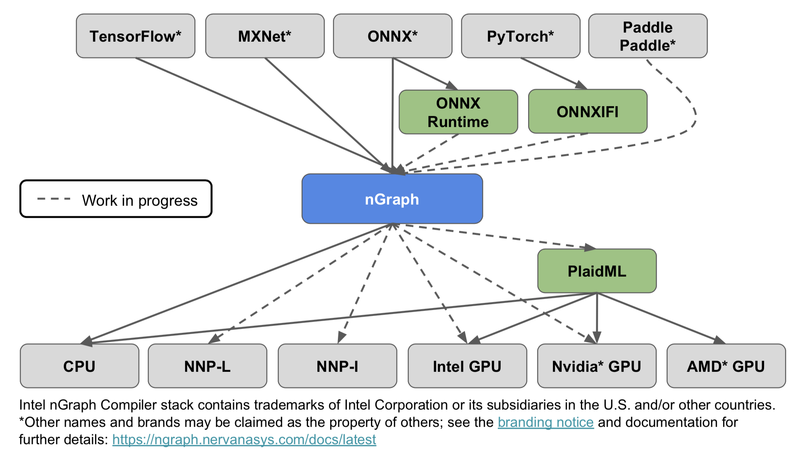

 [![Build Status][build-status-badge]][build-status] 

  <h4>
    <a href="./ABOUT.md">Architecture & features</a> | <a href="./ecosystem-overview.md" >Ecosystem</a> | <a href="https://ngraph.nervanasys.com/docs/latest/project/release-notes.html">Release notes</a> |  <a href="https://ngraph.nervanasys.com/docs/latest">Documentation</a> |  <a href="#How-to-contribute" >Contribution guide</a>
 </h4>

## Quick start

To begin using nGraph with popular frameworks to accelerate deep learning 
workloads on CPU for inference, please refer to the links below. 

|  Framework (Version)       | Installation guide                     | Notes  
|----------------------------|----------------------------------------|-----------------------------------
| TensorFlow*                | [Pip install](https://github.com/tensorflow/ngraph-bridge#use-pre-built-packages) or [Build from source](https://github.com/tensorflow/ngraph-bridge#build-ngraph-from-source) | 20 [Validated workloads]   
| ONNX 1.4                   | [Pip install](https://github.com/NervanaSystems/ngraph-onnx#installation)                          | 17 [Validated workloads] 

#### Python wheels for nGraph 

The Python wheels for nGraph have been tested and are supported on the following 
64-bit systems

* Ubuntu 16.04 or later
* CentOS 7.6
* Debian 10
* macOS 10.14.3 (Mojave)

Frameworks using nGraph Compiler stack to execute workloads have shown 
[**up to 45X**](https://ai.intel.com/ngraph-compiler-stack-beta-release/) 
performance boost when compared to native framework implementations. We've also 
seen performance boosts running workloads that are not included on the list of  
[Validated workloads], thanks to nGraph's powerful subgraph pattern matching.

Additionally we have integrated nGraph with [PlaidML] to provide deep learning 
performance acceleration on Intel, nVidia, & AMD GPUs. More details on current 
architecture of the nGraph Compiler stack can be found in [Architecture and features],
and recent changes to the stack are explained in [Release Notes].

## What is nGraph Compiler? 

nGraph Compiler aims to accelerate developing AI workloads using any deep learning
framework and deploying to a variety of hardware targets. We strongly believe in 
providing freedom, performance, and ease-of-use to AI developers. 

The diagram below shows deep learning frameworks and hardware targets
supported by nGraph. NNP-L and NNP-I in the diagram refer to Intel's next generation 
deep learning accelerators: Intel® Nervana™ Neural Network Processor for Learning and 
Inference respectively.  Future plans for supporting addtional deep learning frameworks 
and backends are outlined in the [ecosystem] section. 

While the ecosystem shown above is all functioning, we have validated 
performance for deep learning inference on CPU processors, such as Intel® Xeon® 
for the Beta release of nGraph. The Gold release is targeted for June 2019; it 
will feature broader workload coverage including quantized graphs (int8) and 
will implement support for dynamic shapes. 

Our documentation has extensive information about how to use nGraph Compiler 
stack to create an nGraph computational graph, integrate custom frameworks, 
and to interact with supported backends. If you wish to contribute to the 
project, please don't hesitate to ask questions in [GitHub issues] after 
reviewing our contribution guide below. 

## How to contribute

We welcome community contributions to nGraph. If you have an idea how
to improve it:

* See the [contrib guide] for code formatting and style guidelines.
* Share your proposal via [GitHub issues].
* Ensure you can build the product and run all the examples with your patch.
* In the case of a larger feature, create a test.
* Submit a [pull request].
* Make sure your PR passes all CI tests. Note: our [Travis-CI][build-status] service
  runs only on a CPU backend on Linux. We will run additional tests
  in other environments.
* We will review your contribution and, if any additional fixes or
  modifications are necessary, may provide feedback to guide you. When
  accepted, your pull request will be merged to the repository.

[Ecosystem]: ./ecosystem-overview.md
[Architecture and features]:https://ngraph.nervanasys.com/docs/latest/project/about.html
[Documentation]: https://ngraph.nervanasys.com/docs/latest
[build the Library]: https://ngraph.nervanasys.com/docs/latest/buildlb.html
[Getting Started Guides]: Getting-started-guides
[Validated workloads]: https://ngraph.nervanasys.com/docs/latest/frameworks/validated/list.html
[Functional]: https://github.com/NervanaSystems/ngraph-onnx/ 
[How to contribute]: How-to-contribute
[framework integration guides]: https://ngraph.nervanasys.com/docs/latest/frameworks/index.html
[release notes]: https://ngraph.nervanasys.com/docs/latest/project/release-notes.html
[Github issues]: https://github.com/NervanaSystems/ngraph/issues
[contrib guide]: https://ngraph.nervanasys.com/docs/latest/project/contribution-guide.html
[pull request]: https://github.com/NervanaSystems/ngraph/pulls
[how to import]: https://ngraph.nervanasys.com/docs/latest/core/constructing-graphs/import.html
[ngraph_wireframes_with_notice]: doc/sphinx/source/graphics/readme_stack.png "nGraph wireframe"
[ngraph_diagram_with fw_hw]: doc/sphinx/source/graphics/main_diagram_fw_hw.png "nGraph stack with current framework & backend support"
[ngraph-compiler-stack-readme]: doc/sphinx/source/graphics/ngraph-compiler-stack-readme.png "nGraph Compiler Stack"
[build-status]: https://travis-ci.org/NervanaSystems/ngraph/branches
[build-status-badge]: https://travis-ci.org/NervanaSystems/ngraph.svg?branch=master
[PlaidML]: https://github.com/plaidml/plaidml
[Source compile]: https://github.com/NervanaSystems/ngraph-mxnet/blob/master/README.md
[nGraph-ONNX]: https://github.com/NervanaSystems/ngraph-onnx/blob/master/README.md
[nGraph-ONNX adaptable]: https://ai.intel.com/adaptable-deep-learning-solutions-with-ngraph-compiler-and-onnx/
[nGraph for PyTorch developers]: https://ai.intel.com/investing-in-the-pytorch-developer-community
