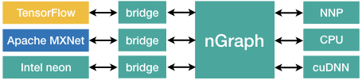

.. about: 

About
=====

Intel nGraph library provides a suite of components to promote computational 
efficiency and enable portability of Deep Neural Network (DNN) models defined in 
a variety of frameworks. The library translates a framework's representation of 
computations into a neutral-intermediate representation specifically designed to 
run better on target hardware, on both Intel and non-Intel platforms.

There is a *framework bridge* for each supported framework which acts as an 
intermediary between the *nGraph core* and the framework. A *transformer* plays 
a similar role among the layers and various execution platforms.

The *nGraph core* uses a strongly-typed and platform-neutral stateless graph 
representation for computations. Each node, or :term:`op`, in the graph 
corresponds to one step in a computation, where each step produces zero or more 
tensor outputs from zero or more tensor inputs.

Transformers compile the graph using a combination of generic and 
platform-specific graph transformation. The result is a function that
can be executed from the framework bridge. Transformers also allocate
and deallocate, as well as read and write, tensors under direction of the
bridge.