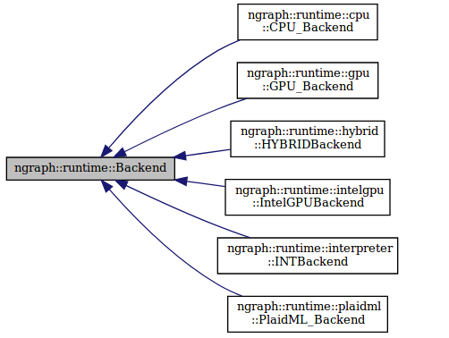

.. backend-support/cpp-api.rst:

Runtime Backends 
################

   Various backends are accessible via nGraph core APIs

Backend
=======

.. doxygenclass:: ngraph::runtime::Backend
   :project: ngraph
   :members:

Tensor
======

.. doxygenclass:: ngraph::runtime::Tensor
   :project: ngraph
   :members:

HostTensor
==========

.. doxygenclass:: ngraph::runtime::HostTensor
   :project: ngraph
   :members:

PlaidML
=======

.. doxygenclass:: ngraph::runtime::plaidml::PlaidML_Backend
   :project: ngraph
   :members: