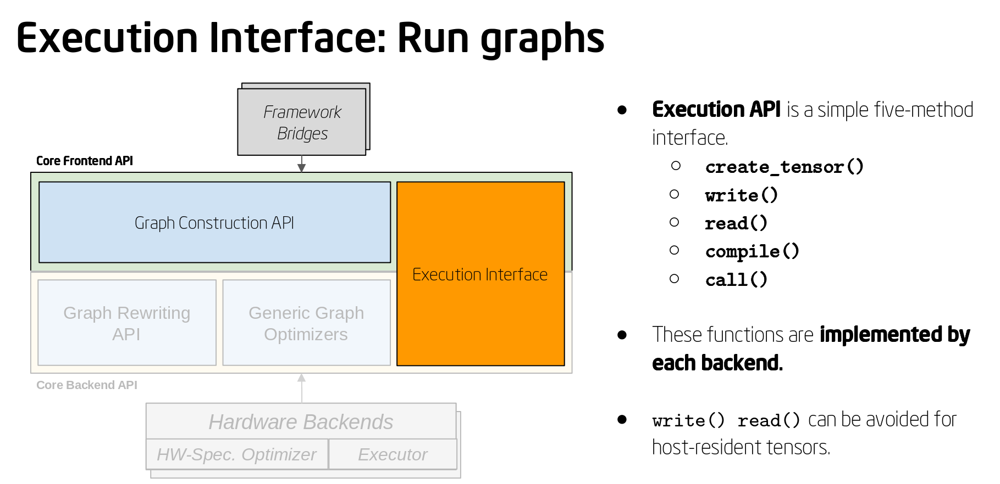

.. backends/index.rst

#####################
Working with Backends
#####################

* :ref:`what_is_backend`
* :ref:`how_to_use`
* :ref:`miscellaneous_resources`

.. _what_is_backend:

What is a backend?
------------------

In the nGraph Compiler stack, what we call a *backend* is responsible for 
function execution and value allocation. A backend can be used to 
:doc:`carry out computations<../core/constructing-graphs/execute>` 
from a framework on a CPU, GPU, or ASIC; it can also be used with an 
*Interpreter* mode, which is primarily intended for testing, to analyze a 
program, or to help a framework developer customize targeted solutions. 

nGraph also provides a way to use the advanced tensor compiler PlaidML 
as a backend; you can learn more about this backend and how to build it 
from source in our documentation: :ref:`ngraph_plaidml_backend`.

.. csv-table::
   :header: "Backend", "Current nGraph support", "Future nGraph support"
   :widths: 35, 10, 10

   Intel® Architecture Processors (CPUs), Yes, Yes
   Intel® Nervana™ Neural Network Processor™ (NNPs), Yes, Yes
   AMD\* GPUs, Yes, Some

Each backend must define a function ``ngraph_register_${backend}_backend`` 
that registers a backend constructor function and ensures that 
initializations are performed. An example that includes initializations 
can be found in the ``ngraph/src/runtime/cpu/cpu_backend.cpp`` file. See 
also: :ref:`backend_api_macros`.

.. _how_to_use:

How to use?
-----------

#. Create a ``Backend``; think of it as a compiler. 
#. A ``Backend`` can then produce an ``Executable`` by calling ``compile``. 
#. A single iteration of the executable is executed by calling the ``call``
   method on the ``Executable`` object.

   The execution interface for nGraph 

The nGraph execution API for ``Executable`` objects is a simple, five-method 
interface; each backend implements the following five functions:

* The ``create_tensor()`` method allows the bridge to create tensor objects 
  in host memory or an accelerator's memory.
* The ``write()`` and ``read()`` methods are used to transfer raw data into 
  and out of tensors that reside in off-host memory.
* The ``compile()`` method instructs the backend to prepare an nGraph function 
  for later execution.
* And, finally, the ``call()`` method is used to invoke an nGraph function 
  against a particular set of tensors.

.. _miscellaneous_resources: 

Miscellaneous resources
=======================

Additional resources for device or framework-specific configurations:

OpenCL
------

OpenCL is needed for the :doc:`plaidml-ng-api/index`; this is not needed if 
you have only a CPU backend.  

#. Install the latest Linux driver for your system. You can find a list 
   of drivers at https://software.intel.com/en-us/articles/opencl-drivers;
   You may need to install `OpenCL SDK`_ in case of an ``libOpenCL.so`` absence.

#. Any user added to "video" group: 

   .. code-block:: console 

      sudo usermod –a –G video <user_id>

   may, for example, be able to find details at the ``/sys/module/[system]/parameters/`` location. 

nGraph Bridge from TensorFlow\*
~~~~~~~~~~~~~~~~~~~~~~~~~~~~~~~

When specified as the generic backend -- either manually or automatically 
from a framework --  ``NGRAPH`` defaults to CPU, and it also allows for 
additional device configuration or selection. 

Because nGraph can select backends, specifying the ``INTELGPU`` 
backend as a runtime environment variable also works if one is 
present in your system: 

:envvar:`NGRAPH_TF_BACKEND="INTELGPU"`

An `axpy.py example`_ is optionally available to test; outputs will vary 
depending on the parameters specified. 

.. code-block:: console

   NGRAPH_TF_BACKEND="INTELGPU" python3 axpy.py

* ``NGRAPH_INTELGPU_DUMP_FUNCTION`` -- dumps nGraph’s functions 
  in dot format.

.. _axpy.py example: https://github.com/tensorflow/ngraph-bridge/blob/master/examples/axpy.py
.. _OpenCL SDK: https://software.intel.com/en-us/opencl-sdk
