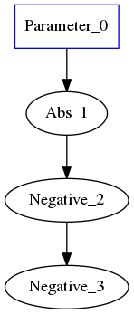
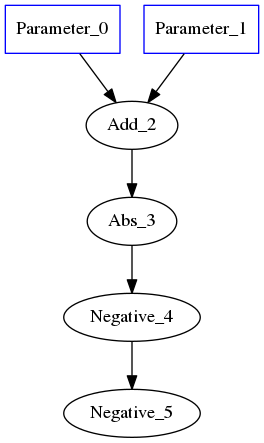
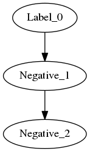
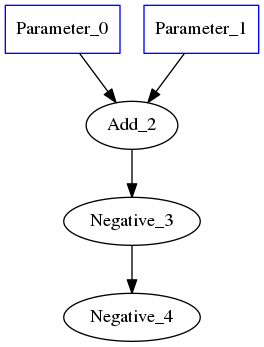
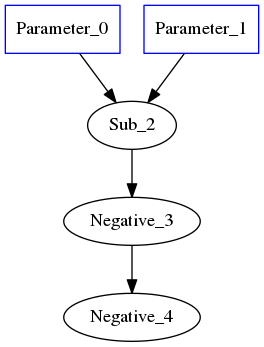
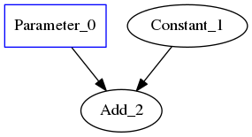
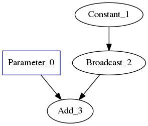
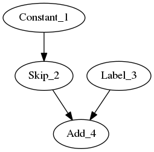

.. fusion/graph-rewrite.rst:

Using ``GraphRewrite`` to fuse ops
==================================

* :ref:`exact`
* :ref:`labels`

.. _exact: 

Exact pattern matching
----------------------

For the example of ``-(-A) = A``, various graphs of varying complexity can be 
created and overwritten with recipes for pattern-matching + graph-rewrite. To 
get started, a simple example for a trivial graph, followed by more complex 
examples: 

|image3|

.. code-block:: cpp 

    auto a = make_shared<op::Parameter>(element::i32, shape);
    auto absn = make_shared<op::Abs>(a);
    auto neg1 = make_shared<op::Negative>(absn);
    auto neg2 = make_shared<op::Negative>(neg1);

|image4|

	
.. code-block:: cpp 

    auto a = make_shared<op::Parameter>(element::i32, shape);
    auto b = make_shared<op::Parameter>(element::i32, shape);
    auto c = a + b;
    auto absn = make_shared<op::Abs>(c);
    auto neg1 = make_shared<op::Negative>(absn);
    auto neg2 = make_shared<op::Negative>(neg1);

Label AKA ``.`` in regexes
~~~~~~~~~~~~~~~~~~~~~~~~~~~

|image5|

For the code below, ``element::f32`` will still match integer Graph1 and 
Graph2 

.. code-block:: cpp

    //note element::f32, will still match integer Graph1 and Graph2 
    auto lbl = std::make_shared<pattern::op::Label>(element::f32, Shape{});  
    auto neg1 = make_shared<op::Negative>(lbl);
    auto neg2 = make_shared<op::Negative>(neg1);

.. _labels:

Constructing labels from existing nodes
---------------------------------------

Double Negative w/ Addition
~~~~~~~~~~~~~~~~~~~~~~~~~~~

|image6|

.. code-block:: cpp

    auto a = make_shared<op::Parameter>(element::i32, shape);
    //`lbl` borrows the type and shape information from `a`
    auto lbl = std::make_shared<pattern::op::Label>(a);  
    auto neg1 = make_shared<op::Negative>(a);
    auto neg2 = make_shared<op::Negative>(neg1);

Double Negative w/ Subtraction  
~~~~~~~~~~~~~~~~~~~~~~~~~~~~~~

|image7|

Predicates are of type ``std::function<bool(std::shared_ptr<Node>)>``

.. code-block:: cpp
   
    //predicates are of type std::function<bool(std::shared_ptr<Node>)>
    auto add_or_sub =  {
        return std::dynamic_pointer_cast<op::Add>(n) != nullptr ||
            std::dynamic_pointer_cast<op::Sub>(n) != nullptr
    };

    auto lbl = std::make_shared<pattern::op::Label>(
        element::f32, 
        Shape{}, 
        add_or_sub
    );  
    auto neg1 = make_shared<op::Negative>(a);
    auto neg2 = make_shared<op::Negative>(neg1);

 