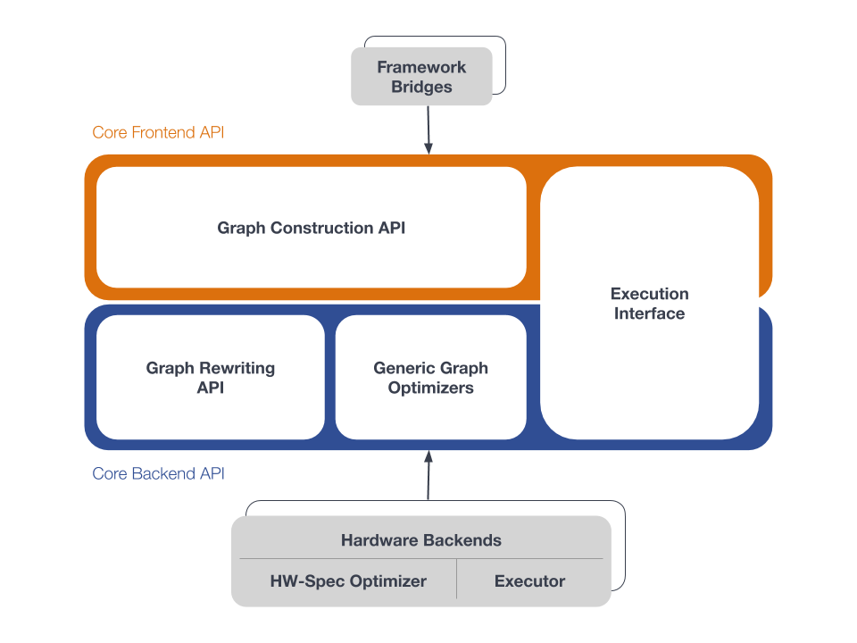

.. core/overview.rst:

Basic concepts
==============

   The whole nGraph Compiler stack  

The nGraph Compiler stack consists of bridges, core, and backends. We'll examine 
each of these briefly to get started. 

A framework bridge interfaces with the "frontend" Core API. A framework bridge 
is a component that sits between a framework like TensorFlow or PaddlePaddle, and the
nGraph Core frontend API. A framework bridge does two things: first, it 
translates a framework's operations into graphs in nGraph’s in-memory 
:abbr:`Intermediary Representation (IR)`. Second, it executes the nGraph IR 
graphs via the backend execution interface.

The details of bridge implementation vary from framework to framework, but there 
are some common patterns: a fairly typical example for a graph-based framework 
is illustrated here, and consists of basically two phases: a **clustering** 
phase and a **translation** phase.

.. figure:: ../graphics/overview-translation-flow.svg
   :width: 725px
   :alt: Translation flow to an nGraph function graph

   Translation flow to an nGraph function 

The clustering phase operates on the original framework's graph. During this 
stage, we look for maximal subgraphs containing nodes that can be translated 
to data flow functions in nGraph. The ability to capture subgraphs of the original 
graph means that we maintain interoperability with the native framework runtime. 
Any node that is not placed in a cluster can still by handled by the native 
framework. On the other hand, identifying maximal subgraphs means that we can 
avoid unnecessary handoffs between the native framework runtime and nGraph; 
minimizing this is good for performance.

In the second phase, called translation, we cut out each cluster subgraph, 
translate it into an nGraph Function, and replace the cluster subgraph with a 
stand-in node called an "encapsulation node" that holds a pointer to the nGraph 
``Function``. Later, at runtime, those functions will be invoked when the 
framework asks us to execute the encapsulation node.

It’s worth noting that backends have total freedom to rewrite the nGraph 
Functions: they can do it for the sake of structural or algorithmic optimization 
of the graph, for easy integration with kernel libraries, or for any or no 
reason at all.

Namespaces in nGraph
--------------------

What follows here is a table of all documented namespaces with brief 
descriptions:

 
.. csv-table::
   :header: "Namespace", "Description", "Location in Repo", "Docs"
   :widths: 23, 53, 13, 23

   ``ngraph``, The Intel nGraph C++ API, ngraph, Implicit namespace omitted from most API documentation
   ``builder``, "Convenience functions that create additional graph nodes to implement commonly-used recipes; for example, auto-broadcast", `builder`_, Coming Soon
   ``descriptor``, Descriptors are compile-time representations of objects that will appear at run-time, `descriptor`_, Coming Soon
   ``op``, Ops used in graph construction, `op`_, :doc:`../ops/index`
   ``runtime``, The objects and methods used for executing the graph, `runtime`_, :doc:`../backends/cpp-api`

.. _builder: https://github.com/NervanaSystems/ngraph/tree/master/src/ngraph/builder
.. _descriptor: https://github.com/NervanaSystems/ngraph/tree/master/src/ngraph/descriptor
.. _op: https://github.com/NervanaSystems/ngraph/tree/master/src/ngraph/op
.. _runtime: https://github.com/NervanaSystems/ngraph/tree/master/src/ngraph/runtime
