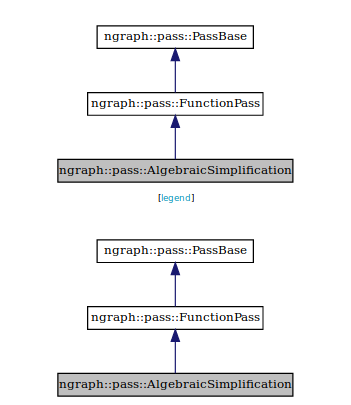

.. core/passes/list-of-passes:

List of passes
==============

.. csv-table::
   :header: "Pass Name", "More Detail"
   :widths: 29, 31
   :escape: ~

   ``AlgebraicSimplification``, :ref:`algebraic_simpl`
   ``AssignLayout``, Coming Soon
   ``CallGraphPass``, Coming Soon
   ``CommonFunctionCollection``, Coming Soon
   ``CommonSubexpressionElimination``, :ref:`common_subex_elim`
   ``ConstantFolding``, :ref:`constant_fold`
   ``CoreFusion``, Coming Soon
   ``DumpSorted``, Coming Soon
   ``FunctionPass``, Coming Soon
   ``GetOutputElementElimination``, Coming Soon
   ``GraphRewrite``, Coming Soon
   ``LikeReplacement``, Coming Soon
   ``Liveness``, Coming Soon
   ``Manager``, Coming Soon
   ``ManagerState``, Coming Soon
   ``MemoryLayout``, Coming Soon
   ``MemoryManager``, Coming Soon
   ``MemoryVisualize``, Coming Soon
   ``ModulePass``, Coming Soon
   ``NodePass``, Coming Soon
   ``NopElimination``, Coming Soon
   ``PassBase``, Coming Soon
   ``PassConfig``, Coming Soon
   ``PrefixReshapeElimination``, Coming Soon
   ``PropagateCacheability``, Coming Soon
   ``RecurrentGraphRewrite``, Coming Soon
   ``ReshapeElimination``, :ref:`reshape_transpose_elim`
   ``ReshapeSinking``, :ref:`reshape_transpose_sink`
   ``Serialization``, Coming Soon
   ``ValidateGraph``, Coming Soon
   ``VisualizeTree``, Coming Soon
   ``ZeroDimTensorElimination``, Coming soon 

.. important:: All of the above passes are currently implementable; more 
   detailed documentation for each pass may be a :abbr:`Work In Progress (WIP)` 
   (WIP).

.. _algebraic_simpl: 

``Algebraic Simplification``
----------------------------

   Algebraic simplification

The **Algebraic Simplification** pass implements what amounts to a "grab bag" of 
algebraic simplification rules. It does some basic things like rewrite "zero 
times x" to simply "zero", or "zero plus x" to plain "x".

It can also do a number of tricks more specific to deep learning. For example,
if we discover that a tensor is being sliced up by adjacent segments, only to 
have those slices concatenated back together again, we can skip the slicing and 
concatting altogether. Or, if a tensor is being padded, but the actual width of 
the padding is zero all around, we can skip the padding step entirely.

Several other transformations like this are implemented in the algebraic 
simplification pass. And while none of these transformations might seem 
particularly impressive on their own, when everything comes together the 
results of this pass often yield improvement even on the initial graph straight 
out of the bridge. This pass is also quite important as a "glue" pass that can 
be used to clean up and/or re-simplify after other passes have done their own 
tricks.  See the example on :doc:`passes` for an example of how effective this 
can be. 

.. _common_subex_elim: 

``Common Subexpression Elimination``
-------------------------------------

.. _constant_fold:

``Constant Folding``
--------------------

.. _core_fusion:

``Core Fusion``
---------------

.. _reshape_transpose_elim:

``Reshape Elimination``
-----------------------

The pass also called **Reshape/Transpose Elimination** will find and optimize where 
we can "push" two ``Transpose`` ops through a matrix multiplication. For example, 
if you have two matrices (say, *foo* and *bar*), both of these matrices will be 
transposed (to produce *foo.t* and *bar.t*, respectively), aftew which *foo.t* 
and *bar.t* get multiplied together.

Often a more efficient way to implement this is to switch the order of the 
arguments *foo* and *bar*, multiply them together, and then transpose the output 
of the matmul. Effectively, this cuts two `Transpose` operations down to just 
one, where the **Reshape/Transpose** elimination will do that rewrite for you.

Another common pattern can be optimized via nGraph is the case where two 
transpositions cancel each other out. One example of this is taking the 
"Transpose" of the transpose of a matrix, though actually a more common case is 
when the graph is translating among different batch formats. We can often move 
these operations around through a process called **Reshape sinking/swimming**, 
and in cases where two transposes wind up canceling each other out, we can cut 
them both out of the graph.

.. _reshape_transpose_sink:

``Reshape Sinking``
-------------------

.. _elementzero_tensor_elim:

``Zero-Element Tensor Elimination``
-----------------------------------   