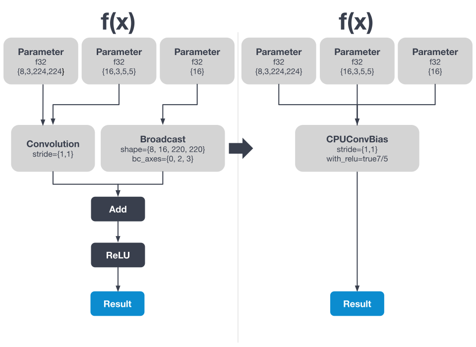
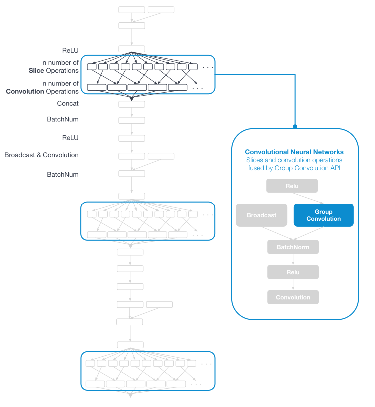

.. core/passes/passes.rst:

.. _core_compiler_passes:

Compiler Passes
===============

.. toctree::
   :maxdepth: 1
   :caption: Compiler passes 

   list-of-passes.rst 
   passes-that-use-matcher.rst

Basic concepts
--------------

*Generic graph optimization passes*

This section discusses how to use nGraph to create a Pass Manager for your
backend, and provides both a simple and a complex example to follow. 

The pass manager infrastructure in nGraph makes it easy to reuse and mix the 
generic optimization passes. It also permits you to roll your own device-specific 
optimizations; that is, the same unified interface and APIs may be used to 
cover both things.

Invoking these passes is fairly straightforward, illustrated by the following 
steps and the code below.   

#. Create a "pass manager" object (line 1)
#. Populate it with the desired pass or passes (lines 2-4)
#. Invoke the pass manager with a pointer to your unoptimized graph, and 
   it will return a pointer to an optimized graph (lines 5-6)

.. literalinclude:: ../../../../../test/cpu_fusion.cpp
   :language: cpp
   :lines: 2085-2092
   :linenos: 

nGraph Core includes a large library of hardware-agnostic passes useful 
for almost any kind of hardware backend. Some of these passes are likely familiar 
to people who are comfortable with classical compiler designs. Others, like the 
reshape/transpose elimination and sinking passes, are quite specific to deep 
learning.

A simple example
----------------

Here's a fairly straightforward function graph: it has 4 ops: 
:doc:`../../ops/convolution`, :doc:`../../ops/broadcast`, :doc:`../../ops/add`, 
and :doc:`../../ops/relu`. With nGraph, backends have the ability to rewrite the 
graph in ways that are specific to the underlying device/hardware's capabilities. 

When, for example, the device is an Intel® Architecture :abbr:`IA (Intel® Architecture)` 
CPU, it can support a fused ``ConvolutionBiasReLU`` kernel. The backend is able 
to rewrite the graph into its own custom ops that more closely match the 
hardware-specific primitives; here they get matched via Intel® MKL-DNN. 

.. _figure-simple-compiler:

   Figure A: On the left side of *Figure A* is a fully-formed function 
   graph prior to fusion. After graph rewrite, the CPU implements a number of
   custom fusions.

A complex example
-----------------

The effectiveness of graph-level optimization with nGraph is more striking to look 
at in terms of an actual input graph, such as one from the framework bridge. Here 
is slightly more complicated example drawn from a topology called MobileNet which 
makes heavy use of group convolution. 

In group convolution, sometimes called depthwise convolution, a batch's different 
feature channels get divided into groups that are processed independently, rather 
than every convolution kernel seeing all of the input feature channels.

With "Group Convolution Fusion", it is possible to optimize a subgraph that has
implemented group convolution by many instances of "ordinary" convolution.

*Figure B* shows an excerpt from ``MobileNet v1``, a topology which makes heavy 
use of group convolution. Here, an image batch and a filter batch first undergo 
a  "preprocessing" phase where segments along the channel axis are sliced out: 
one per channel group. Next, there are separate convolutions on each channel 
group before finally concatenating the result back together.

.. _figure-mobilenet-gc:

   Figure B: Each of these grouped convolution complexes -- the 
   operations within the rectangles on the left -- is very wide; each is too 
   wide to fit legibly on the illustration.  

The group convolution fusion is able to replace each of those giant subgraphs 
with a single CPU group convolution node. This ends up being beneficial in 
several ways: 

* Reduces sheer node count, 
* Provides mappability to MKL-DNN, which has an accelerated group convolution implementation, and 
* Eliminates unnecessary temporary nodes.
