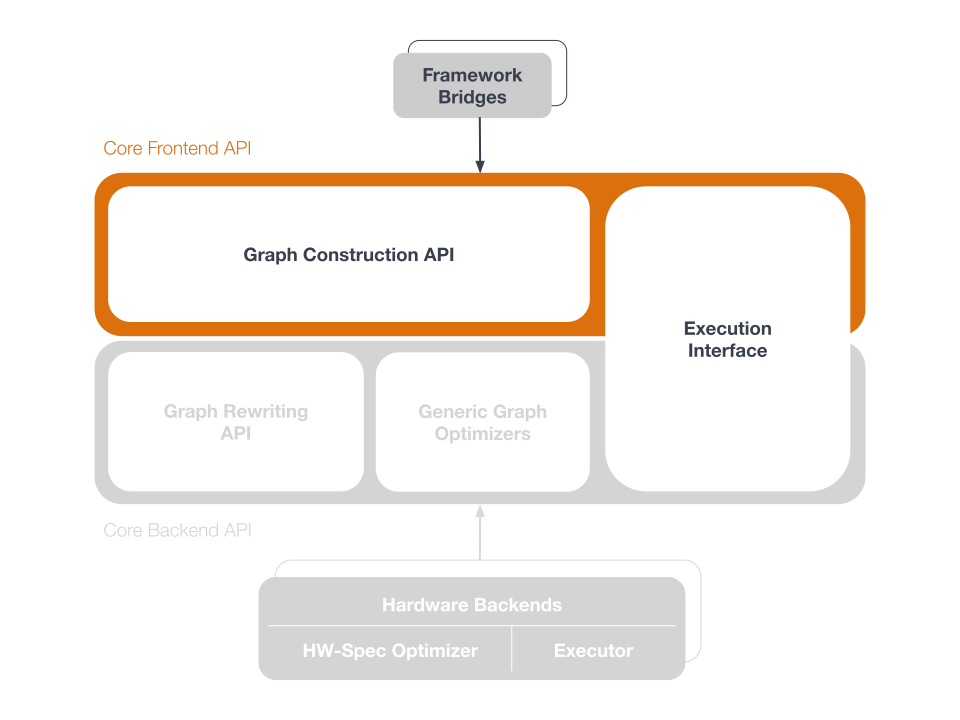

:orphan: 

.. frameworks/fw_overview:

.. _fw_overview:

Overview
========

A framework is "supported" with a framework :term:`bridge` that can be written or
cloned and used to connect to nGraph device backends while maintaining the 
framework's programmatic or user interface. There is a bridge for the 
`TensorFlow framework`_. We also have a :doc:`paddle_integ` bridge. Intel 
previously contributed work to an MXNet bridge; however, support for this 
bridge is no longer active.

`ONNX`_ on its own is not a framework; however, it can be used with nGraph's
:doc:`../python_api/index` to import and execute ONNX models.

   Framework bridge to nGraph

Once connected via the bridge, the framework can then run and train a deep
learning model with various workloads on various backends using nGraph Compiler
as an optimizing compiler available through the framework.

While a :abbr:`Deep Learning (DL)` :term:`framework` is ultimately meant for
end use by data scientists, or for deployment in cloud container environments,
nGraph Core ops and the nGraph C++ Library are designed for framework builders
themselves. We invite anyone working on new and novel frameworks or neural
network designs to explore our highly-modularized stack of components that
can be implemented or integrated in countless ways.

Please read this section if you are considering incorporating components from
the nGraph Compiler stack in your framework or neural network design. Contents
here are also useful if you are working on something built-from-scratch, or on
an existing framework that is less widely-supported than the popular frameworks
like TensorFlow and PyTorch.

.. figure:: ../graphics/overview-translation-flow.svg
   :width: 725px
   :alt: Translation flow to nGraph function graph

.. _TensorFlow framework: https://github.com/tensorflow/ngraph-bridge/README.md
.. _ONNX: http://onnx.ai/
.. _tune the workload to extract best performance: https://ai.intel.com/accelerating-deep-learning-training-inference-system-level-optimizations
.. _a few small: https://software.intel.com/en-us/articles/boosting-deep-learning-training-inference-performance-on-xeon-and-xeon-phi
