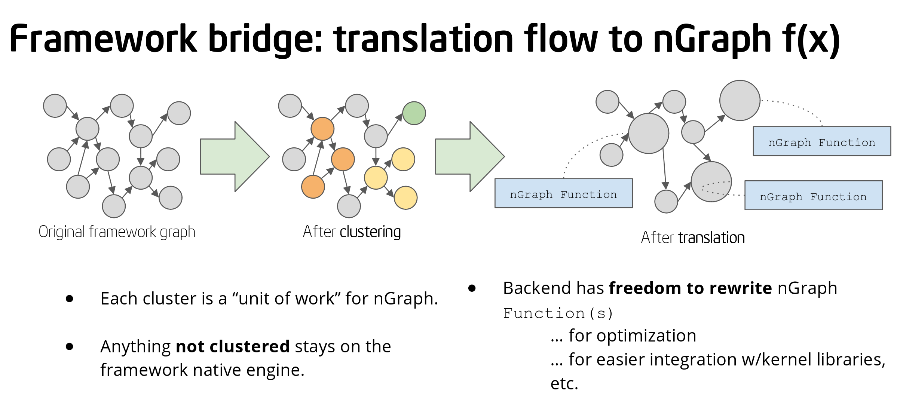

.. frameworks/getting_started.rst

Getting Started
###############

No matter what your level of experience with :abbr:`Deep Learning (DL)` systems 
may be, nGraph provides a path to start working with the DL stack. Let's begin 
with the easiest and most straightforward options.

The easiest way to get started is to use the latest PyPI `ngraph-tensorflow-bridge`_,
which has instructions for Linux* systems, and tips for users of Mac OS X. 

You can install TensorFlow\* and nGraph to a virtual environment; otherwise, the code 
will install to a system location.

.. code-block:: console
   
   pip install tensorflow
   pip install ngraph-tensorflow-bridge

.. note:: You may need to use the latest versions of ``tensorflow`` and the bridge
   to get pip installs to work.  See the :doc:`tensorflow_connect` file for more
   detail about working with TensorFlow\*.

That's it! Now you can test the installation by running the following command:

.. code-block:: console

   python -c "import tensorflow as tf; print('TensorFlow version: ',tf.__version__);import ngraph_bridge; print(ngraph_bridge.__version__)"

Output will look something like:

:: 

    TensorFlow version:  [version]
    nGraph bridge version: b'[version]'
    nGraph version used for this build: b'[version-rc-hash]'
    TensorFlow version used for this build: v[version-hash]
    CXX11_ABI flag used for this build: boolean

More detail in the `ngraph_bridge examples`_ directory. 

ONNX
====

Another easy way to get started working with the :abbr:`DL (Deep Learning)`
stack is to try the examples available via `nGraph ONNX`_.

Installation
------------

To prepare your environment to use nGraph and ONNX, install the Python packages
for nGraph, ONNX and NumPy:

::

    $ pip install ngraph-core onnx numpy

Now you can start exploring some of the :doc:`onnx_integ` examples.

See also nGraph's :doc:`../python_api/index`.

PlaidML
=======

See the :ref:`ngraph_plaidml_backend` section on how to build the 
nGraph-PlaidML.

Other integration paths
=======================

If you are considering incorporating components from the nGraph Compiler stack 
in your framework or neural network design, another useful doc is the section 
on :doc:`generic-configs`. Contents here are also useful if you are working on 
something built-from-scratch, or on an existing framework that is less 
widely-supported than the popular frameworks like TensorFlow and PyTorch.

.. _ngraph-tensorflow-bridge: https://pypi.org/project/ngraph-tensorflow-bridge
.. _ngraph ONNX: https://github.com/NervanaSystems/ngraph-onnx
.. _ngraph_bridge examples: https://github.com/tensorflow/ngraph-bridge/blob/master/examples/README.md
