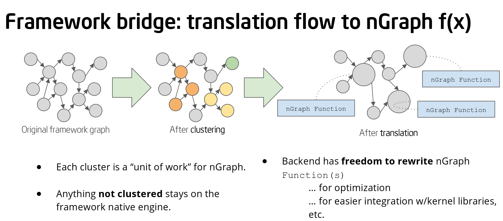

.. frameworks/index.rst: 

.. TODO update CODEOWNERS for this new structure

#################
Framework Support   
#################

.. toctree::
   :maxdepth: 1
   :caption: Current framework integration

   tensorflow_integ.rst
   mxnet_integ.rst
   onnx_integ.rst
   paddle_integ.rst

.. toctree::
   :maxdepth: 1
   :caption: Validated workloads by framework

   validation.rst
   testing-latency.rst

.. toctree::
   :maxdepth: 1
   :caption: New frameworks 

   generic-configs.rst

A framework is "supported" when there is a framework :term:`bridge` that can be 
cloned from one of our GitHub repos and built to connect to nGraph device backends, 
all the while maintaining the framework's programmatic or user interface. Bridges 
currently exist for the TensorFlow\* and MXNet\* frameworks. 

.. figure:: graphics/bridge-to-graph-compiler.png
    :width: 733px
    :alt: JiT compiling of a computation

    :abbr:`Just-in-Time (JiT)` Compiling for computation

Once connected via the bridge, the framework can then run and train a deep 
learning model with various workloads on various backends using nGraph Compiler 
as an optimizing compiler available through the framework.  

While a :abbr:`Deep Learning (DL)` :term:`framework` is ultimately meant for 
end use by data scientists, or for deployment in cloud container environments, 
nGraph Core ops and the nGraph C++ Library are designed for framework builders 
themselves. We invite anyone working on new and novel frameworks or neural 
network designs to explore our highly-modularized stack of components that can 
be implemented or integrated in virtually limitless ways.

Please read the articles in this section if you are considering incorporating 
components from the nGraph Compiler stack in your framework or neural network 
design. Articles here are also useful if you are working on something 
built-from-scratch, or on an existing framework that is less widely-supported 
than the popular frameworks like TensorFlow and PyTorch. 

.. _figure-4:

   Figure 4: How a framework bridge

Enabling Deep Learning paradigms  
================================

Framework architects or engineers who can't quite find what they need among 
the existing DL tools may need to build something new off a "stock" framework, 
or someting entirely from scratch. For this category of developer, we have 
:doc:`documented several ways <../howto/index>` you can incorporate built-in 
compiler support for users of your framework; this includes out-of-box support 
for things like Intel® MKL-DNN and PlaidML when your framework supports nGraph 
as a "backend" or engine. 

   .. important:: nGraph does not provide an interface for "users" of frameworks 
      (for example, we cannot dictate or control how Tensorflow* or MXNet* presents 
      interfaces to users). Please keep in mind that designing and documenting 
      the :abbr:`User Interface (UI)` of step 3 above is entirely in the realm 
      of the framework owner or developer and beyond the scope of the nGraph 
      Compiler stack. However, any framework can be designed to make direct use 
      of nGraph Compiler stack-based features and then expose an accompanying UI, 
      output message, or other detail to a user.
 
The nGraph :abbr:`IR Intermediate Representation` is format that can understand 
inputs from a framework. Today, there are two primary tasks that can be accomplished 
in the “bridge code” space of the nGraph IR: 

#. Compiling a dataflow graph 
#. Executing a pre-compiled graph. 

See the :doc:`../frameworks/index` for how we built bridges with our 
initially-supported frameworks. For more in-depth help in writing things like 
graph optimizations and bridge code, we provide articles on how to 
:doc:`../fusion/index`, and programmatically :doc:`../howto/execute` that can 
target various compute resources using nGraph when a framework provides some 
inputs to be computed.

.. note:: Configuration options can be added manually on the command line or via 
   scripting. Please keep in mind that fine-tuning of parameters is as much of 
   an art as it is a science; there are virtually limitless ways to do so and 
   our documentation provides only a sampling.  

Understanding users of frameworks
=================================

A data scientist or ML engineer may not initially know which framework is the 
"best" framework to use to start working on his or her problem set. While there 
are several to choose from, it can be daunting and time consuming to scope the 
wide array of features and customization options offered by some of the more 
popular frameworks:

#. First **find** a tested and working DL model that does something *similar* 
   to what the data scientist or ML engineer wants to do. To assist with this 
   stage, we've already provided organized tables of :doc:`validation` examples.
#. Next, **replicate** that result using well-known datasets to confirm that the 
   model does indeed work. To assist with this stage, we've released several  
   :doc:`pip installation options <../frameworks/index>` that can 
   be used to test basic examples.
#. Finally, **modify** some aspect: add new datasets, or adjust an algorithm's 
   parameters to hone in on specifics that can better train, forecast, or predict 
   scenarios modeling the real-world problem. This is also the stage where it 
   makes sense to `tune the workload to extract best performance`_.

   .. important:: nGraph does not provide an interface for "users" of frameworks 
      (for example, we cannot dictate or control how Tensorflow* or MXNet* presents 
      interfaces to users). Please keep in mind that designing and documenting 
      the :abbr:`User Interface (UI)` is entirely in the realm of the framework owner 
      or developer and beyond the scope of the nGraph Compiler stack. However, any 
      framework can be designed to make direct use of nGraph Compiler stack-based 
      features and then expose an accompanying UI, output message, or other detail 
      to a user.

Clearly, one challenge of the framework developer is to differentiate from 
the pack by providing a means for the data scientist to obtain reproducible 
results. The other challenge is to provide sufficient documentation, or to 
provide sufficient hints for how to do any "fine-tuning" for specific use cases. 
With the nGraph Compiler stack powering your framework, it becomes much easier 
to help your users get reproducible results with nothing more complex than the 
CPU that powers their operating system.   

In general, the larger and more complex a framework is, the harder it becomes 
to navigate and extract the best performance; configuration options that are 
enabled by "default" from the framework side can sometimes slow down compilation 
without the developer being any the wiser. Sometimes only `a few small`_ 
adjustments can increase performance. Likewise, a minimalistic framework that 
is designed around one specific kind of model can sometimes offer significant 
performance-improvement opportunities by lowering overhead. 

See :doc:`generic-configs` to get started.   

.. _tune the workload to extract best performance: https://ai.intel.com/accelerating-deep-learning-training-inference-system-level-optimizations
.. _a few small: https://software.intel.com/en-us/articles/boosting-deep-learning-training-inference-performance-on-xeon-and-xeon-phi
