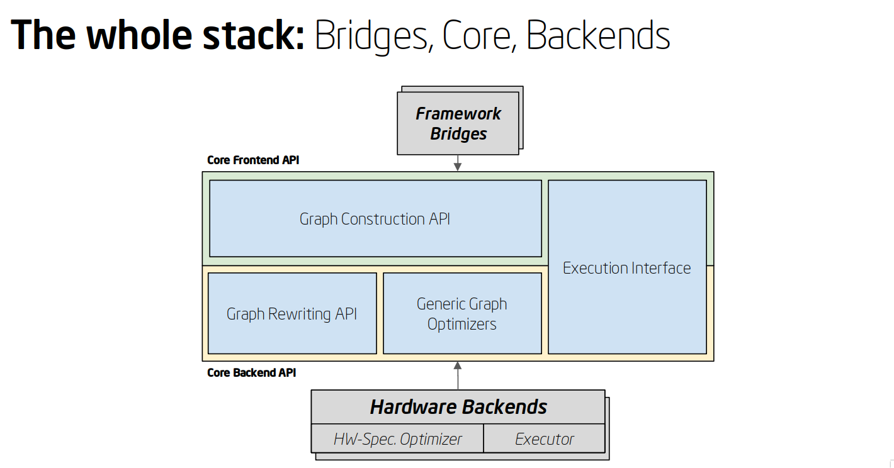

.. frameworks/index.rst: 

Connect a framework  
===================

.. toctree::
   :maxdepth: 1
   
   tensorflow_connect.rst
   mxnet_integ.rst
   onnx_integ.rst
   paddle_integ.rst
   validated/testing-latency.rst

A framework is "supported" when there is a framework :term:`bridge` that can be 
cloned from one of our GitHub repos and built to connect to nGraph device 
backends while maintaining the framework's programmatic or user interface. Bridges 
currently exist for the TensorFlow\* and MXNet\* frameworks. 

ONNX is not a framework; however, it can be used with nGraph's :doc:`../python_api/index` 
to import and execute ONNX models.   

    :abbr:`Just-in-Time (JiT)` Compiling for computation. nGraph `Core` components 
    are colored in blue. 

Once connected via the bridge, the framework can then run and train a deep 
learning model with various workloads on various backends using nGraph Compiler 
as an optimizing compiler available through the framework.  

While a :abbr:`Deep Learning (DL)` :term:`framework` is ultimately meant for 
end use by data scientists, or for deployment in cloud container environments, 
nGraph Core ops and the nGraph C++ Library are designed for framework builders 
themselves. We invite anyone working on new and novel frameworks or neural 
network designs to explore our highly-modularized stack of components that can 
be implemented or integrated in countless ways.

Please read this section if you are considering incorporating components from 
the nGraph Compiler stack in your framework or neural network design. Contents 
here are also useful if you are working on something built-from-scratch, or on 
an existing framework that is less widely-supported than the popular frameworks 
like TensorFlow and PyTorch. 

.. figure:: ../graphics/translation-flow-to-ng-fofx.png
   :width: 725px
   :alt: Translation flow to nGraph function graph

.. _tune the workload to extract best performance: https://ai.intel.com/accelerating-deep-learning-training-inference-system-level-optimizations
.. _a few small: https://software.intel.com/en-us/articles/boosting-deep-learning-training-inference-performance-on-xeon-and-xeon-phi

