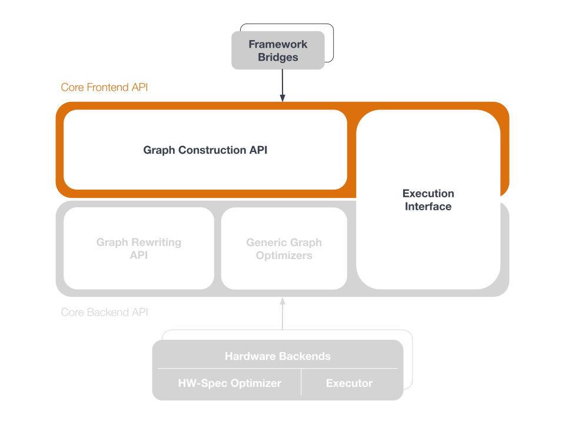
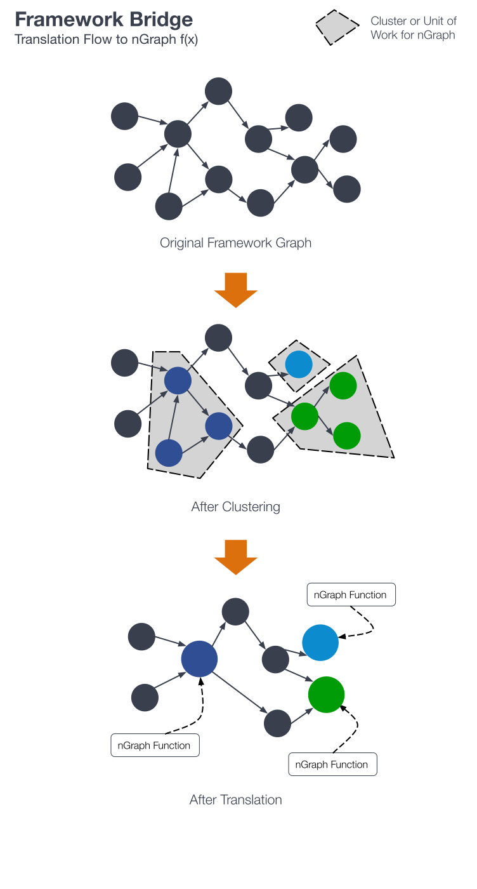

.. frameworks/overview.rst

Basic concepts
==============

   A framework bridge connects to the nGraph graph construction API

To understand how a data science :term:`framework` (:doc:`TensorFlow <tensorflow_connect>`, 
PyTorch, :doc:`paddle_integ`, and others) can unlock acceleration available in 
the nGraph Compiler, it helps to familiarize yourself with some basic concepts.

We use the term :term:`bridge` to describe code that connects to any nGraph 
device backend(s) while maintaining the framework's programmatic or user 
interface. We have a `bridge for the TensorFlow framework`_. We also have a 
:doc:`paddle_integ` bridge. Intel previously :doc:`contributed work to an MXNet bridge <../project/extras/testing_latency>`; 
however, support for the MXNet bridge is no longer active. 

`ONNX`_ on its own is not a framework; it can be used with nGraph's 
:doc:`../python_api/index` to import and execute ONNX models.

Because it is framework agnostic (providing opportunities to optimize at the 
graph level), nGraph can do the heavy lifting required by many popular 
:doc:`workloads <validated/list>` without any additional effort of the framework user.
Optimizations that were previously available only after careful integration of 
a kernel or hardware-specific library are exposed via the 
:doc:`Core graph construction API <../core/constructing-graphs/index>`

The illustration above shows how this works. 

While a :abbr:`Deep Learning (DL)` framework is ultimately meant for end-use by 
data scientists, or for deployment in cloud container environments, nGraph's 
:doc:`Core ops <../core/overview>` are designed for framework builders themselves. 
We invite anyone working on new and novel frameworks or neural network designs 
to explore our highly-modularized stack of components.

Please read the :doc:`other` section for other framework-agnostic 
configurations available to users of the nGraph Compiler stack. 

.. _bridge for the TensorFlow framework: https://github.com/tensorflow/ngraph-bridge/README.md
.. _ONNX: http://onnx.ai/
.. _tune the workload to extract best performance: https://ai.intel.com/accelerating-deep-learning-training-inference-system-level-optimizations
.. _a few small: https://software.intel.com/en-us/articles/boosting-deep-learning-training-inference-performance-on-xeon-and-xeon-phi