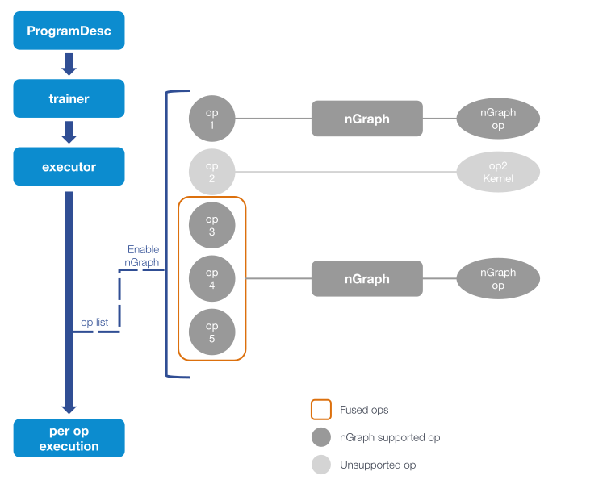
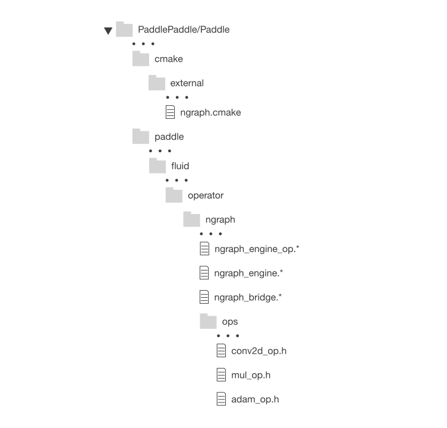

.. frameworks/paddle_integ.rst:

PaddlePaddle\*
==============

PaddlePaddle is an open source deep learning framework developed by Baidu. It 
aims to enable performant large-scale distributed computation for deep learning. 
The nGraph Compiler stack's integration to PaddlePaddle respects PaddlePaddle’s
design philosophy to minimize switching cost for users. To access nGraph from
PaddlePaddle, we've added three modules to PaddlePaddle:

* nGraph engine operator (op), 
* nGraph engine, and 
* nGraph bridge. 

The nGraph engine op inherits the PaddlePaddle operator class to allow nGraph 
engine op to be called using methods consistent with other PaddlePaddle operators. 
When the nGraph engine is called by the aforementioned op, the nGraph bridge 
converts PaddlePaddle operators into nGraph operators. nGraph will then build a 
computational graph based on the converted ops according to the input topology. 

Integration design
------------------

Key design criteria for nGraph-PaddlePaddle integration includes:

#. Minimal intermediate links between nGraph and PaddlePaddle, to reduce latency 
   and improve performance.
#. Close to no switching cost for end users of PaddlePaddle framework.
#. Ease of maintenance.

To satisfy the first design criteria, nGraph designed its operator to match 
PaddlePaddle's implementation. nGraph is triggered by the PaddlePaddle 
executor by one line of code.

After nGraph engine is called, it and the nGraph C++ backend manage all the 
heavy lifting for performance optimization. The Python frontend on PaddlePaddle
remains the same, and end users need **no changes** in the code they write
to be able to benefit from the increased performance. This design fulfills 
the second criteria.

Lastly, the code contributed by nGraph to PaddlePaddle repository mainly 
resides in the ``fluid/operator/ngraph`` directory, and having most of the 
nGraph code in one place allows for easy maintenance. 

.. _figure-paddle-design:

*Figure A* above depicts nGraph access from PaddlePaddle. The PaddlePaddle 
executor generates an executable operator according to the program 
description (ProgramDesc). nGraph scans the operator sequence before 
execution, and replaces the supported operators (or subgraphs) with nGraph 
operators. PaddlePaddle can then execute the nGraph operators and the 
unreplaced PaddlePaddle operators with a uniform interface. The unreplaced 
operators are executed by PaddlePaddle native implementation.

nGraph's current integration reflected on PaddlePaddle's github repository 
is organized in the following file structure:  

.. _figure-paddle-dir:

Compilation of nGraph is handled by the ``ngraph.cmake`` file in the 
``cmake/external directory``. Other newly-introduced files are 
located primarily in the paddle/fluid/operator/ngraph directory. The 
nGraph operators replacing PaddlePaddle operators as described in 
the previous section can be found in the ``ngraph/ops`` directory.

Integration details 
-------------------

More details on implementation of nGraph engine op, nGraph engine, 
and nGraph bridges are provided below: 

#. **nGraph engine op**: Triggers subgraphs to be executed by nGraph.

   - Input: Input variable set

   - Output: Output variable set

   - Attribute :
     
     + Graph: Serialized subgraph. The protobuffer described 
       by PaddlePaddle is serialized and passed to nGraph **as a string**.
     
     + Interval: The interval of ops in operator list that will be executed by nGraph.
      
   - Related code :
     
     + ``Paddle/fluid/operators/ngraph/ngraph_engine_op.h``  `link to ngraph_engine_op header code`_
     
     + ``Paddle/fluid/operators/ngraph/ngraph_engine_op.cc``  `link to ngraph_engine_op cpp code`_
 

#. **nGraph engine**: calls the nGraph Library to perform calculations.

   The nGraph engine class includes the input and output required to build 
   a nGraph function graph from the nGraph engine kernel, the execution
   function, and the data exchange between nGraph and PaddlePaddle. 
   The primary methods are:

      - ``BuildNgIO``: gets input and output variables.
      - ``GetNgFunction``: obtains the nGraph function used in the calculation. 
        It matches entire pattern of the input to the output and saves functions 
        that need to be called repeatedly.
      - ``BuildNgFunction``: builds nGraph functions.
      - ``Run``: calls backend execution  and exchange data with the paddle.
      - Related code :
         - ``Paddle/fluid/operators/ngraph/ngraph_engine.h`` `link to ngraph_engine header code`_
         - ``Paddle/fluid/operators/ngraph/ngraph_engine.cc`` `link to ngraph_engine cpp code`_
 
3. **nGraph bridge**: converts PaddlePaddle operators to nGraph operators.

   The nGraph bridge converts supported PaddlePaddle operators to nGraph 
   operators, which results in a reconstruction of the subgraph with 
   nGraph's intermediate representation. The convertable operators are 
   `located in the ngraph ops`_ directory, and each operator has its 
   own files for easy management. For the conversion of operators. There 
   is a common unified interface to facilitate code development and 
   operator transformation. The relevant interfaces are:

   - GetInputNode: obtains input node for the conversion operator. The nodes
     are managed through a map.
   - SetOutputNode: sets the constructed node to the map.
   - Related code :
      - ``Paddle/fluid/operators/ngraph/ngraph_bridge.h`` `link to ngraph_bridge header code`_
      - ``Paddle/fluid/operators/ngraph/ngraph_bridge.cc``  `link to ngraph_bridge cpp code`_

nGraph compilation control and trigger method
----------------------------------------------

#. **Compile Control** -- The compilation of nGraph is controlled with the 
   ``WITH_NGRAPH`` option. If compiled using ``WITH_NGRAPH=ON``, the nGraph 
   Library will be downloaded and compiled. This option has a corresponding 
   ``PADDLE_WITH_NGRAPH`` flag. If compiled ``WITH_NGRAPH=OFF``, the relevant 
   code will not be compiled.

#. **Trigger Control** -- ``FLAGS_use_ngraph`` triggers nGraph. If this option 
   is set to ``true``, nGraph will be triggered by the PaddlePaddle executor 
   to convert and execute the supported subgraph. Demos are provided under    
   ``paddle/benchmark/fluid/train/demo`` (link `train_demo`_) and ``paddle/benchmark/fluid/train/imdb_demo`` 
   (link `imdb_demo`_) 

.. _link to ngraph_engine_op header code: https://github.com/PaddlePaddle/Paddle/blob/develop/paddle/fluid/operators/ngraph/ngraph_engine_op.h
.. _link to ngraph_engine_op cpp code: https://github.com/PaddlePaddle/Paddle/blob/develop/paddle/fluid/operators/ngraph/ngraph_engine_op.cc
.. _link to ngraph_engine header code: https://github.com/PaddlePaddle/Paddle/blob/develop/paddle/fluid/operators/ngraph/ngraph_engine.h
.. _link to ngraph_engine cpp code: https://github.com/PaddlePaddle/Paddle/blob/develop/paddle/fluid/operators/ngraph/ngraph_engine.cc
.. _located in the ngraph ops: https://github.com/PaddlePaddle/Paddle/tree/develop/paddle/fluid/operators/ngraph/ops
.. _link to ngraph_bridge header code: https://github.com/PaddlePaddle/Paddle/blob/develop/paddle/fluid/operators/ngraph/ngraph_bridge.h
.. _link to ngraph_bridge cpp code: https://github.com/PaddlePaddle/Paddle/blob/develop/paddle/fluid/operators/ngraph/ngraph_bridge.cc
.. _train_demo: https://github.com/PaddlePaddle/Paddle/tree/develop/paddle/fluid/train/demo
.. _imdb_demo: https://github.com/PaddlePaddle/Paddle/tree/develop/paddle/fluid/train/imdb_demo
