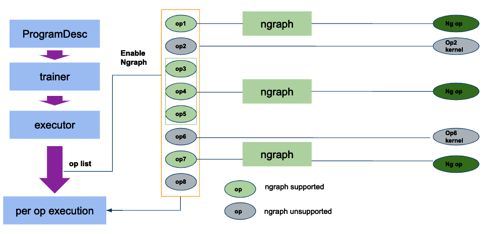
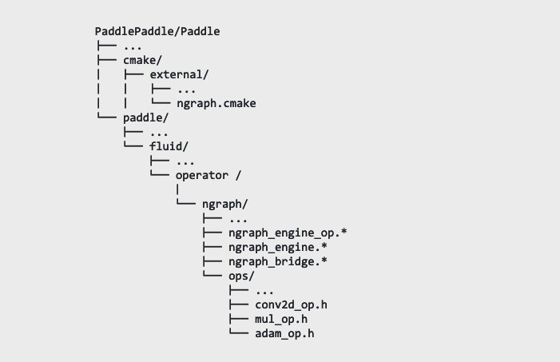

.. paddle_integ.rst:

PaddlePaddle
============

nGraph PaddlePaddle integration overview
----------------------------------------
PaddlePaddle is an open source deep learning framework developed by Baidu. It aims to enable performant large scale distributed computation for deep learning. nGraph Compiler stack is integrated with the current version of PaddlePaddle (Fluid v1.4) and respects PaddlePaddle’s design philosophies to minimize switching cost for users. In order to access nGraph from PaddlePaddle, we added three modules to PaddlePaddle: nGrah engine operator (op), nGraph engine, and nGraph bridge. 

nGraph engine op inherits the PaddlePaddle operator class to allow nGraph engine op to be called using methods consistent with other PaddlePaddle operators. When the nGraph engine is called by the aforementioned op, the nGraph bridge converts PaddlePaddle operators into nGraph operators. nGraph will then build a computational graph based on the converted ops according to the input topology. 

Integration design
----------------------------------------

Here are key design criteria for nGraph PaddlePaddle integration:

1. Minimal intermediate links between nGraph and PaddlePaddle to reduce latency and improve performance
2. Close to no switching cost for end users of PaddlePaddle framework
3. Ease of maintenance 

To satisfy the first design criteria, nGraph designed its operator to match PaddlePaddle implementation. nGraph is triggered by the PaddlePaddle executor exactly in the same way as MKL-DNN and requires one line of code. 

Once nGraph engine is called, performance optimization is handled by nGraph engine and its C++ backend. PaddlePaddle's python frontend remains the same, and end users will not need to change their code to take advantage of nGraph's performance. This design fulfills the second criteria.

Lastly, the code contributed by nGraph to PaddlePaddle repository mainly resides in the fluid/operator/ngraph directory, and having most of the nGraph code in one place allows for easy maintenance. 

.. _figure-A:

The diagram above depicts nGraph access from PaddlePaddle. The PaddlePaddle executor generates executable operator according to the program description (ProgramDesc). nGraph scans the operator sequence before execution and replaces the supported operators (or subgraphs) with nGraph operators. PaddlePaddle can then execute the nGraph operators and unreplaced PaddlePaddle operators with a uniform interface. The unreplaced operators are executed by PaddlePaddle native implementation.

nGraph's current integration reflected on PaddlePaddle's github repository is organized in the following file structure:  

.. _figure-B:

Compilation of nGraph is handled by ngraph.cmake file in the cmake/external directory. Other newly introduced files are mostly located in the paddle/fluid/operator/ngraph directory. The nGraph operators that replace PaddlePaddle operators as described in the previous section can be found in the ngraph/ops directory.

Integration details 
-------------------

More details on implementation of nGraph engine op, nGraph engine, and nGraph bridges are provided below: 

1. **nGraph engine op**: Triggers subgraphs to be executed by nGraph.

      - Input: Input variable set

      - Output: Output variable Set

      - Attribute :
         - Graph: Serialized subgraph. The protobuff described by PaddlePaddle is serialized and passed to nGraph as a string.
         - Interval: FIG operator to replace the column nGraph interval. The operators in the interval will be executed by nGraph.
      
      - Related code :
         - Paddle/fluid/operators/ngraph/ngraph_engine_op.h
         - Paddle/fluid/operators/ngraph/ngraph_engine_op.cc
 

2. **Ngraph engine**: calls the nGraph library to perform calculations.

      nGraph engine class includes the input and output required to build nGraph graph from the nGraph engine kernel, the execution function, and the data exchange between nGraph and PaddlePaddle. The main methods are

      - BuildNgIO: Gets input and output variables.
      - GetNgFunction: Obtains the nGraph function used in the calculation. It matches entire pattern of the input to the output and saves functions that need to be called repeatedly.
      - BuildNgFunction: builds nGraph functions.
      - Run: calls backend execution  and exchange data with the paddle.
      - Related code :
         - paddle/fluid/operators/ngraph/ngraph_engine.h
         - paddle/fluid/operators/ngraph/ngraph_engine.cc
 
3. **nGraph bridge**: Converts PaddlePaddle operators to nGraph operators
      The nGraph bridge converts the supported PaddlePaddle operators to nGraph operators to reconstruct the subgraph with nGraph's intermediate representation. The convertable operators are located in the ngraph/ops directory, and each operator has its own files for easy management. For the conversion of operators, there is a common unified interface to facilitate code development and operator transformation. The relevant interfaces are

      - Get InputNode: The input node used to obtain the conversion operator. The node has unordered graph management.
      - SetOutputNode: An operator management diagram for adding the operator of the first conversion.
      - Related code :
         - paddle/fluid/operators/ngraph/ngraph_bridge.h
         - paddle/fluid/operators/ngraph/ngraph_bridge.cc

nGraph compilation control and trigger method
--------------------------------------------

1. **Compile Control**: The compilation of nGraph is controlled with the WITH_NGRAPH option. If WITH_NGRAPH=ON, the nGraph library will be downloaded and compiled. This option has a corresponding PADDLE_WITH_NGRAPH control. If WITH_NGRAPH=OFF, the relevant code will not be compiled.

2. **Trigger Control**: FLAGS_use_ngraph triggers nGraph. If this option is set to *true*, nGraph will be triggered by the PaddlePaddle executor to convert and execute the supported subgraph. Examples are provided under paddle/benchmark/fluid/ngraph, and the scripts can be executed with the following command line: 
      - FLAGS_ues_ngrap=true python train.py 
      - FLAGS_ues_ngrap=true python infer.py 

 

