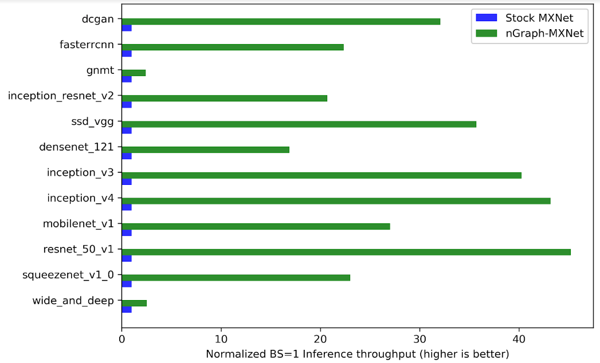

.. frameworks/validated/testing-latency.rst:

Testing latency  
###############

Many open-source DL frameworks provide a layer where experts in data science 
can make use of optimizations contributed by machine learning engineers. Having 
a common API benefits both: it simplifies deployment and makes it easier for ML 
engineers working on advanced deep learning hardware to bring highly-optimized 
performance to a wide range of models, especially in inference.  

One DL framework with advancing efforts on graph optimizations is Apache 
MXNet\*, where `Intel has contributed efforts showing`_ how to work with our
nGraph Compiler stack as an `experimental backend`_. Our approach provides 
**more opportunities** to start working with different kinds of graph 
optimizations **than would be available to the MXNet framework alone**, for 
reasons outlined in our `features`_ documentation.

.. TODO : Link to latest on mxnet when/if they do this instead of linking to PR;
   keep in mind this tutorial will still work  regardless of the merge status of 
   the experimental backend if you already use the ngraph-mxnet Github repo 

    Up to 45X faster compilation with nGraph backend

Tutorial: Testing inference latency of ResNet-50-V2 with MXNet
==============================================================

This tutorial supports compiling MXNet with nGraph's CPU backend.

Begin by cloning MXNet from GitHub:
     
.. code-block:: console

   git clone --recursive https://github.com/apache/incubator-mxnet

To compile run:
           
.. code-block:: console

   cd incubator-mxnet
   make -j USE_NGRAPH=1

MXNet's build system will automatically download, configure, and build the 
nGraph library, then link it into ``libmxnet.so``. Once this is complete, we 
recommend building a python3 virtual environment for testing, and then 
install MXNet to the virtual environment:

.. code-block:: console

   python3 -m venv .venv
   . .venv/bin/activate
   cd python
   pip install -e .
   cd ../

Now we're ready to use nGraph to run any model on a CPU backend. Building MXNet 
with nGraph automatically enabled nGraph on your model scripts, and you 
shouldn't need to do anything special. If you run into trouble, you can disable 
nGraph by setting 

.. code-block:: console
   
   MXNET_SUBGRAPH_BACKEND=

If you do see trouble, please report it and we'll address it as soon as possible.

Running ResNet-50-V2 Inference
------------------------------

To show a working example, we'll demonstrate how MXNet may be used to run 
ResNet-50 Inference. For ease, we'll consider the standard MXNet ResNet-50-V2
model from the `gluon model zoo`_, and we'll test with ``batch_size=1``. 
Note that the nGraph-MXNet bridge supports static graphs only (dynamic graphs 
are in the works); so for this example, we begin by converting the gluon model 
into a static graph. Also note that any model with a saved checkpoint can be 
considered a "static graph" in nGraph. For this example, we'll presume that the 
model is pre-trained.   

.. literalinclude:: ../../../../examples/subgraph_snippets/mxnet-gluon-example.py
   :language: python
   :lines: 17-32

To load the model into nGraph, we simply bind the symbol into an Executor. 

.. literalinclude:: ../../../../examples/subgraph_snippets/mxnet-gluon-example.py
   :language: python
   :lines: 34-35

At binding, the MXNet Subgraph API finds nGraph, determines how to partition 
the graph, and in the case of Resnet, sends the entire graph to nGraph for 
compilation. This produces a single call to an NNVM ``NGraphSubgraphOp`` embedded 
with the compiled model. At this point, we can test the model's performance.

.. literalinclude:: ../../../../examples/subgraph_snippets/mxnet-gluon-example.py
   :language: python
   :lines: 40-48

.. _experimental backend: https://github.com/apache/incubator-mxnet/pull/12502
.. _Intel has contributed efforts showing: https://cwiki.apache.org/confluence/display/MXNET/MXNet+nGraph+integration+using+subgraph+backend+interface
.. _features: http://ngraph.nervanasys.com/docs/latest/project/about.html#features
.. _gluon model zoo: https://github.com/apache/incubator-mxnet/blob/master/python/mxnet/gluon/model_zoo/vision/resnet.py#L499
.. _subgraph acceleration API: https://cwiki.apache.org/confluence/display/MXNET/Unified+integration+with+external+backend+libraries
.. _nGraph-MXNet: https://github.com/NervanaSystems/ngraph-mxnet/blob/master/README.md
