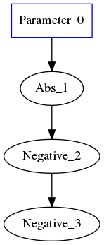
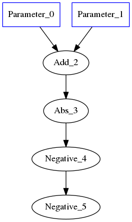
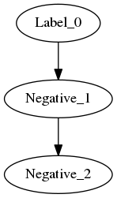
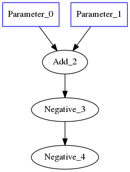
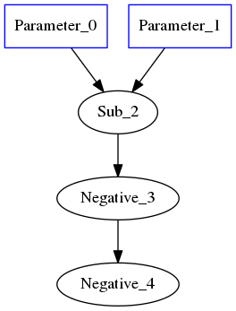
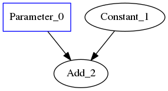
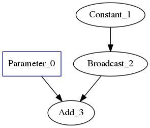
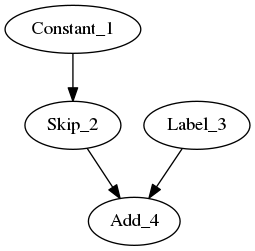

.. fusion/graph-rewrite.rst:

Using ``GraphRewrite`` to fuse ops
-----------------------------------

Exact pattern matching
~~~~~~~~~~~~~~~~~~~~~~

For the example of ``$-(-A) = A$``, various graphs of varying complexity can be 
created and overwritten with recipes for pattern-matching + graph-rewrite. To 
get started, a simple example for a trivial graph, followed more more complex 
examples: 

|image3|

.. code-block:: cpp 

   auto a = make_shared(element::i32, shape); 
   auto absn = make_shared(a); 
   auto neg1 = make_shared(absn); 
   auto neg2 = make_shared(neg1);

|image4|

	
.. code-block:: cpp 

    auto a = make_shared(element::i32, shape); 
    auto b = make_shared(element::i32, shape); 
    auto c = a + b; 
    auto absn = make_shared(c); 
    auto neg1 = make_shared(absn); 
    auto neg2 = make_shared(neg1); 

Label AKA ``.`` in regexes
^^^^^^^^^^^^^^^^^^^^^^^^^^^

|image5|

For the code below, ``element::f32`` will still match integer Graph1 and 
Graph2 

.. code-block:: cpp

   auto lbl = std::make_shared(element::f32, Shape{}); 
   auto neg1 = make_shared(lbl); auto neg2 = make_shared(neg1);

Constructing labels from existing nodes
~~~~~~~~~~~~~~~~~~~~~~~~~~~~~~~~~~~~~~~

Double Negative w/ Add
^^^^^^^^^^^^^^^^^^^^^^

|image6|

.. code-block:: cpp

   auto a = make_shared(element::i32, shape); 
   //`lbl` borrows the type and shape information from `a` auto lbl = std::make_shared(a); 
   auto neg1 = 	make_shared(a); 
   auto neg2 = make_shared(neg1); 

Double Negative w/ Sub  
^^^^^^^^^^^^^^^^^^^^^^

|image7|

Predicates are of type ``std::function<bool(std::shared_ptr<Node>)>``

.. code-block:: cpp
   
   auto add_or_sub =  {
    return std::dynamic_pointer_cast<op::Add>(n) != nullptr ||
        std::dynamic_pointer_cast<op::Sub>(n) != nullptr
   };
   
   auto lbl = std::make_shared<pattern::op::Label>(
    element::f32, 
    Shape{}, 
    add_or_sub
   );  
   auto neg1 = make_shared<op::Negative>(a);
   auto neg2 = make_shared<op::Negative>(neg1);

Passes that use Matcher
=======================

* CPUFusion (GraphRewrite)
* CoreFusion (GraphRewrite)
* ReshapeElimination (GraphRewrite)
* AlgebraicSimplification
* CPUPostLayoutOptimizations (GraphRewrite)
* CPURnnMatFusion

Register `simplify_neg` handler
--------------------------------

::

  static std::unordered_map)>>
  initialize_const_values_to_ops()
        {
            return std::unordered_map)>>({
                {TI(op::Add), simplify_add},
                {TI(op::Multiply), simplify_multiply},
                {TI(op::Sum), simplify_sum},
                {TI(op::Negative), simplify_neg}
            });
        }

Add a fusion 
~~~~~~~~~~~~

$max(0, A) = Relu(A)$ 

Pattern for capturing 
~~~~~~~~~~~~~~~~~~~~~

|image11|

$max(0, A) = Relu(A)$  
::

            namespace ngraph
            {
                namespace pass
                {
                    class CoreFusion;
                }
            }
            
            class ngraph::pass::CoreFusion : public ngraph::pass::GraphRewrite
            {
            public:
                CoreFusion()
                    : GraphRewrite()
                {
                    construct_relu_pattern();
                }
                void construct_relu_pattern();
            };
            

    void pass::CoreFusion::construct_relu_pattern()
    {
        auto iconst0 = ngraph::make_zero(element::i32, Shape{});
        auto val = make_shared(iconst0);
        auto zero = make_shared(iconst0, nullptr, NodeVector{iconst0});

        auto broadcast_pred =  {
            return static_cast(std::dynamic_pointer_cast(n));
        };
        auto skip_broadcast = std::make_shared(zero, broadcast_pred);
        auto max = make_shared(skip_broadcast, val);

      pattern::graph_rewrite_callback callback = [val, zero](pattern::Matcher& m) { 
            NGRAPH_DEBUG << "In a callback for construct_relu_pattern against "
                         << m.get_match_root()->get_name();

            auto pattern_map = m.get_pattern_map();
            auto mzero = m.get_pattern_map()[zero];
            if (!ngraph::is_zero(mzero))
            {
                NGRAPH_DEBUG << "zero constant = " << mzero->get_name() << " not equal to 0n";
                return false;
            }
            auto mpattern = m.get_match_root();

            auto cg = shared_ptr(new op::Relu(pattern_map[val]));
            ngraph::replace_node(m.get_match_root(), cg);
            return true;
        };

         auto m = make_shared(max, callback); 
        this->add_matcher(m);
    }

Recurrent patterns 
------------------

::
  $ (((A + 0) + 0) + 0) = A$ 

Equivalent to ``"A(BC)+A"`` in regexes 

::
  $ (((A + 0) + 0) + 0) = A$ 

|image12|

|image13|

::
  Shape shape{};
  auto a = make_shared(element::i32, shape);
  auto b = make_shared(element::i32, shape);
  auto rpattern = std::make_shared(b);
  auto iconst0 = ngraph::make_zero(element::i32, shape);
  auto abs = make_shared(a);
  auto add1 = iconst0 + b;
  auto add2 = iconst0 + add1;
  auto add3 = iconst0 + add2;
  auto padd = iconst0 + rpattern;
  std::set> empty_correlated_matches;
  RecurrentMatcher rm(padd, rpattern, empty_correlated_matches, nullptr);
  ASSERT_TRUE(rm.match(add3));

.. |image11| image:: mg/fusion_pattern.png
.. |image12| image:: mg/rp_graph1.png
.. |image13| image:: mg/rp_pattern.png