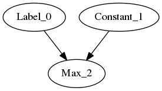
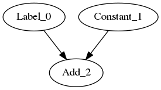

.. fusion/graph-rewrite.rst:

Using ``GraphRewrite`` to fuse ops
-----------------------------------

Exact pattern matching
~~~~~~~~~~~~~~~~~~~~~~

For the example of ``$-(-A) = A$``, various graphs of varying complexity can be 
created and overwritten with recipes for pattern-matching + graph-rewrite. To 
get started, a simple example for a trivial graph, followed by more complex 
examples: 

|image3|

.. code-block:: cpp 

    auto a = make_shared<op::Parameter>(element::i32, shape);
    auto absn = make_shared<op::Abs>(a);
    auto neg1 = make_shared<op::Negative>(absn);
    auto neg2 = make_shared<op::Negative>(neg1);

|image4|

	
.. code-block:: cpp 

    auto a = make_shared<op::Parameter>(element::i32, shape);
    auto b = make_shared<op::Parameter>(element::i32, shape);
    auto c = a + b;
    auto absn = make_shared<op::Abs>(c);
    auto neg1 = make_shared<op::Negative>(absn);
    auto neg2 = make_shared<op::Negative>(neg1);

Label AKA ``.`` in regexes
^^^^^^^^^^^^^^^^^^^^^^^^^^^

|image5|

For the code below, ``element::f32`` will still match integer Graph1 and 
Graph2 

.. code-block:: cpp

    //note element::f32, will still match integer Graph1 and Graph2 
    auto lbl = std::make_shared<pattern::op::Label>(element::f32, Shape{});  
    auto neg1 = make_shared<op::Negative>(lbl);
    auto neg2 = make_shared<op::Negative>(neg1);

Constructing labels from existing nodes
~~~~~~~~~~~~~~~~~~~~~~~~~~~~~~~~~~~~~~~

Double Negative w/ Add
^^^^^^^^^^^^^^^^^^^^^^

|image6|

.. code-block:: cpp

    auto a = make_shared<op::Parameter>(element::i32, shape);
    //`lbl` borrows the type and shape information from `a`
    auto lbl = std::make_shared<pattern::op::Label>(a);  
    auto neg1 = make_shared<op::Negative>(a);
    auto neg2 = make_shared<op::Negative>(neg1);

Double Negative w/ Sub  
^^^^^^^^^^^^^^^^^^^^^^

|image7|

Predicates are of type ``std::function<bool(std::shared_ptr<Node>)>``

.. code-block:: cpp
   
    //predicates are of type std::function<bool(std::shared_ptr<Node>)>
    auto add_or_sub =  {
        return std::dynamic_pointer_cast<op::Add>(n) != nullptr ||
            std::dynamic_pointer_cast<op::Sub>(n) != nullptr
    };

    auto lbl = std::make_shared<pattern::op::Label>(
        element::f32, 
        Shape{}, 
        add_or_sub
    );  
    auto neg1 = make_shared<op::Negative>(a);
    auto neg2 = make_shared<op::Negative>(neg1);

Passes that use Matcher
=======================

* CPUFusion (GraphRewrite)
* CoreFusion (GraphRewrite)
* ReshapeElimination (GraphRewrite)
* AlgebraicSimplification
* CPUPostLayoutOptimizations (GraphRewrite)
* CPURnnMatFusion
* and many more...

Register `simplify_neg` handler
--------------------------------

::

    static std::unordered_map<std::type_index, std::function<bool(std::shared_ptr<Node>)>>
            initialize_const_values_to_ops()
        {
            return std::unordered_map<std::type_index, std::function<bool(std::shared_ptr<Node>)>>({
                {TI(op::Add), simplify_add},
                {TI(op::Multiply), simplify_multiply},
                {TI(op::Sum), simplify_sum},
                {TI(op::Negative), simplify_neg}
            });
        }

Add a fusion 
~~~~~~~~~~~~

$max(0, A) = Relu(A)$ 

Pattern for capturing 
~~~~~~~~~~~~~~~~~~~~~

|image11|

$max(0, A) = Relu(A)$  
::

    namespace ngraph
    {
        namespace pass
        {
            class CoreFusion;
        }
    }
    
    class ngraph::pass::CoreFusion : public ngraph::pass::GraphRewrite
    {
    public:
        CoreFusion()
            : GraphRewrite()
        {
            construct_relu_pattern();
        }

        //this should go in a cpp file.
        void construct_relu_pattern()
        {
            auto iconst0 = ngraph::make_zero(element::i32, Shape{});
            auto val = make_shared(iconst0);
            auto zero = make_shared(iconst0, nullptr, NodeVector{iconst0});

            auto broadcast_pred =  {
                return static_cast(std::dynamic_pointer_cast(n));
            };
            auto skip_broadcast = std::make_shared(zero, broadcast_pred);
            auto max = make_shared(skip_broadcast, val);

        pattern::graph_rewrite_callback callback = [val, zero](pattern::Matcher& m) { 
                NGRAPH_DEBUG << "In a callback for construct_relu_pattern against "
                            << m.get_match_root()->get_name();

                auto pattern_map = m.get_pattern_map();
                auto mzero = m.get_pattern_map()[zero];
                if (!ngraph::is_zero(mzero))
                {
                    NGRAPH_DEBUG << "zero constant = " << mzero->get_name() << " not equal to 0n";
                    return false;
                }
                auto mpattern = m.get_match_root();

                auto cg = shared_ptr(new op::Relu(pattern_map[val]));
                ngraph::replace_node(m.get_match_root(), cg);
                return true;
            };

            auto m = make_shared(max, callback); 
            this->add_matcher(m);
        }
    };
            
Recurrent patterns 
------------------

::
  $ (((A + 0) + 0) + 0) = A$ 

Equivalent to ``"A(BC)+A"`` in regexes 

::
  $ (((A + 0) + 0) + 0) = A$ 

|image12|

|image13|

::
    Shape shape{};
    auto a = make_shared<op::Parameter>(element::i32, shape);
    auto b = make_shared<op::Parameter>(element::i32, shape);
    auto rpattern = std::make_shared<pattern::op::Label>(b);
    auto iconst0 = ngraph::make_zero(element::i32, shape);
    auto abs = make_shared<op::Abs>(a);
    auto add1 = iconst0 + b;
    auto add2 = iconst0 + add1;
    auto add3 = iconst0 + add2;
    auto padd = iconst0 + rpattern;
    std::set<std::shared_ptr<pattern::op::Label>> empty_correlated_matches;
    RecurrentMatcher rm(padd, rpattern, empty_correlated_matches, nullptr);
    ASSERT_TRUE(rm.match(add3));

.. |image4| image:: mg/pr1_graph3.png

.. |image6| image:: mg/pr1_graph4.png
.. |image7| image:: mg/pr1_graph5.png

.. |image10| image:: mg/pr2_pattern2.png

.. |image12| image:: mg/rp_graph1.png
