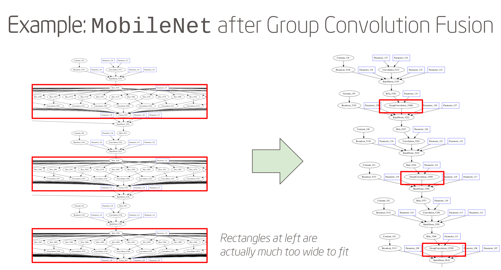

.. fusion/index.rst:

Pattern matcher
###############

* :ref:`overview` 
* :ref:`passes_list`
* :ref:`more_detail` 
* :ref:`passes_examples`
* :doc:`optimize-graphs` 

.. _overview:

Generic graph optimizers: Optimization passes
=============================================

The pass manager infrastructure in nGraph makes it easy to reuse and mix the 
generic optimization passes. It also permits you to roll your own device-specific 
optimizations; that is, the same unified interface and APIs may be used to 
cover both things.

Invoking these passes is fairly straightforward:  

#. Create a "pass manager" object. 
#. Populate it with the desired passes. 
#. Pass to it a pointer to your unoptimized graph, and it’ll return a pointer 
   to an optimized graph.

nGraph Core includes a large library of hardware-agnostic passes -- passes useful 
for almost any kind of hardware backend. Some of these passes should be familiar 
to people who are comfortable with classical compiler designs. Others, like the 
reshape/transpose elimination and sinking passes, are quite specific to deep 
learning.

Let’s take a look at some of these passes.

.. _passes_list:

List of Passes
==============

* :ref:`algebraic_simpl`
* :ref:`common_subex_elim`
* :ref:`constant_fold`
* :ref:`reshape_transpose_elim`
* :ref:`reshape_transpose_sink`

.. _algebraic_simpl: 

Algebraic Simplification
------------------------

The **Algebraic Simplification** pass implements what amounts to a "grab bag" of 
algebraic simplification rules. It does some basic things like rewrite "zero 
times x" to simply "zero", or "zero plus x" to plain "x".

It can also do a number of tricks more specific to deep learning. For example,
if we discover that a tensor is being sliced up by adjacent segments, only to 
have those slices concatenated back together again, we can skip the slicing and 
concatting altogether. 

Or, if a tensor is being padded, but the actual width of the padding is zero 
all around, we can skip the padding step entirely.

Several other transformations like this are implemented in the algebraic 
simplification pass. And while none of these transformations might seem 
particularly impressive on their own, when everything comes together the 
results of this pass often yield improvement even on the initial graph straight 
out of the bridge. This pass is also quite important as a "glue" pass that can 
be used to clean up and/or re-simplify after other passes have done their own 
tricks.

.. _common_subex_elim: 

Common Subexpression Elimination
--------------------------------

.. _constant_fold:

Constant Folding
----------------

.. _core_fusion:

Core Fusion
-----------

.. _reshape_transpose_elim:

Reshape/Transpose Elimination
-----------------------------

The pass called **Reshape/Transpose Elimination** will find and optimize where 
we can "push" two ``Transpose`` ops through a matrix multiplication. For example, 
if you have two matrices (say, *foo* and *bar*), both of these matrices will be 
transposed (to produce *foo.t* and *bar.t*, respectively), aftew which *foo.t* 
and *bar.t* get multiplied together.

Often a more efficient way to implement this is to switch the order of the 
arguments *foo* and *bar*, multiply them together, and then transpose the output 
of the matmul. Effectively, this cuts two `Transpose` operations down to just 
one, where the **Reshape/Transpose** elimination will do that rewrite for you.

Another common pattern can be optimized via nGraph is the case where two 
transpositions cancel each other out. One example of this is taking the 
"Transpose" of the transpose of a matrix, though actually a more common case is 
when the graph is translating among different batch formats. We can often move 
these operations around through a process called **Reshape sinking/swimming**, 
and in cases where two transposes wind up canceling each other out, we can cut 
them both out of the graph.

.. _reshape_transpose_sink:

``Reshape/Transpose Sinking``
-----------------------------

.. _elementzero_tensor_elim:

``Zero-Element Tensor Elimination``
-----------------------------------

.. _more_detail:

More detail
-----------

Let us first consider a simple example. A user would like to execute a graph 
that describes the following arithmetic expression:

:math:`a + b * 1` or :math:`Add(a, Mul(b, 1))` 

In the above expressions, `1` is an identity element; any element multiplied by 
the identity element is equal to itself. This is the same as saying:

:math:`b * 1 = b` 

The writer of an optimization pass which uses algebraic simplification would 
probably want to first ``locate`` all multiplication expressions where 
multiplicands are multiplied by `1` (for stage 1) and to then ``transform``, 
``simplify``, or ``replace`` those expressions with just their multiplicands 
(for stage 2).  

To make the work of an optimization pass writer easier, the nGraph Library 
includes facilities that enable the *finding* of relevant candidates using 
pattern matching (via ``pattern/matcher.hpp``), and the *transforming* of the 
original graph into a condensed version (via ``pass/graph_rewrite.hpp``).

Let's consider each in more detail and many ways they can help the graph 
optimizer. 

.. toctree::
   :maxdepth: 1 

   graph-rewrite.rst
   passes-that-use-matcher.rst
   optimize-graphs.rst
   

.. _passes_examples:

Examples of Passes
==================

The effectiveness of these passes is more striking to look at in terms of an 
actual input graph, such as one from the framework bridge.

*Figure 0* shows an excerpt from ``MobileNet v1``, a topology which makes heavy 
use of group convolution.

.. _figure-mobilenet-gc:

   Figure 0: Each of these grouped convolution complexes -- the 
   operations within the rectangles on the left -- is very wide; each is too 
   wide to fit legibly on the illustration.

The group convolution fusion is able to replace each of those giant subgraphs 
with a single CPU group convolution node. This ends up being a win in several 
ways: 

* sheer node count, 
* mappability to MKL-DNN (which has an accelerated group convolution implementation), 
* elimination of unnecessary temporaries, and so on.