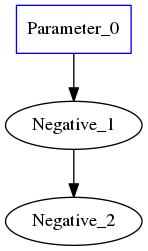
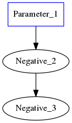

.. fusion/pattern-matching.rst: 

Applying pattern matcher to fuse ops
-------------------------------------

Before delving into the details of pattern matching, note that the sole purpose 
of the pattern-matching step is to **find** patterns in the nGraph IR. A 
subgraph, then, could contain any operation nGraph's IR defines (addition, 
subtraction, etc) along with some special wildcard nodes. 

An analogy that is probably familiar to many programmers is that of the ``Regex``, 
AKA "Regular expression". Just as one can write a regex (pattern) and run it 
through some text to find and/or replace the occurences of that pattern in 
the given text, so too can one write optimization-passes to construct patterns 
which are just regular nGraph graph expressions, and run those patterns through 
given graphs.

In the ``Regex`` analogy, 

.. csv-table::
   :header: "Regex", "nGraph equivalent"
   :widths: 35, 55 
   :escape: ~

   Individual Letters (for example ``A`` or ``y``), ``ngraph::Node``
   Strings (for example ``ABBA`` or ``Hello world``), Graphs consisting of ``ngraph::Nodes``
   Collective Symbols (for some regex programs they are ``*`` or ``.``), ``op::*`` (for some graph programs they are ``pattern::op::Label`` or ``pattern::op::Skip``)

where Operators need arguments, and Leaves cannot take arguments.  

At the lower level, the nGraph C++ API is:  

.. doxygenclass:: ngraph::pattern::Matcher
   :project: ngraph
   :members:

To create a trivial graph representing ``-(-A) = A``:

.. code-block:: cpp 

   auto a = make_shared(element::i32, shape); 
   auto neg1 = make_shared(a); 
   auto neg2 = make_shared(neg1);

|image1|

For exact pattern matching

.. code-block:: cpp 

   auto a = make_shared<op::Parameter>(element::i32, shape);
   auto neg1 = make_shared<op::Negative>(a);
   auto neg2 = make_shared<op::Negative>(neg1);

|image2|

