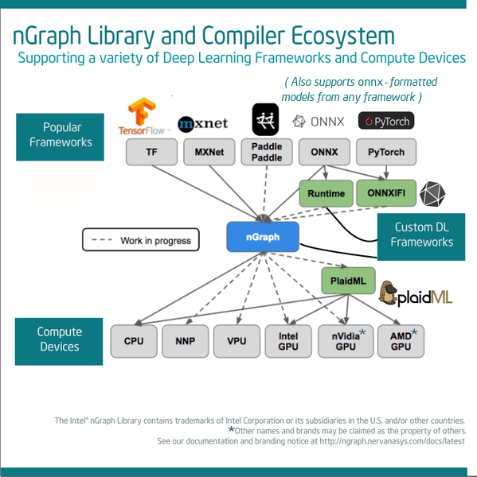

.. ---------------------------------------------------------------------------
.. Copyright 2018 Intel Corporation
.. Licensed under the Apache License, Version 2.0 (the "License");
.. you may not use this file except in compliance with the License.
.. You may obtain a copy of the License at
..
..      http://www.apache.org/licenses/LICENSE-2.0
..
.. Unless required by applicable law or agreed to in writing, software
.. distributed under the License is distributed on an "AS IS" BASIS,
.. WITHOUT WARRANTIES OR CONDITIONS OF ANY KIND, either express or implied.
.. See the License for the specific language governing permissions and
.. limitations under the License.
.. ---------------------------------------------------------------------------

.. This documentation is available online at 
.. https://ngraph.nervanasys.com/docs/latest

Welcome
=======

nGraph is an open-source C++ library, compiler, and runtime accelerator for 
software engineering in the :abbr:`Deep Learning (DL)` ecosystem. nGraph 
simplifies development and makes it possible to design, write, compile, and
deploy :abbr:`Deep Neural Network (DNN)`-based solutions. A more detailed 
explanation of the feature set of nGraph Compiler, as well as a high-level 
overview, can be found on our project :doc:`project/about`. 

.. _quickstart:

Quick Start
===========

We have many documentation pages to help you get started.  

* **TensorFlow or MXNet users** can get started with :doc:`framework-integration-guides`; see also: 

   * `TensorFlow bridge to nGraph`_ 
   * `Compiling MXNet with nGraph`_ 

* **Data scientists** interested in the `ONNX`_ format will find the 
  `nGraph ONNX companion tool`_ of interest. 

* **Framework authors and architects** will likely want to :doc:`buildlb` 
  and learn how nGraph can be used to :doc:`howto/execute`. For examples 
  of generic configurations or optimizations available when designing or 
  bridging a framework directly with nGraph, see :doc:`frameworks/generic`.

* To start learning about nGraph's set of **Core ops** and how they can 
  be used with Ops from other frameworks, go to :doc:`ops/index`.

* **Optimization pass writers** will find :doc:`fusion/index` useful. Also 
  look for our upcoming documentation on :term:`quantization`.

* For details about **PlaidML integration** and other nGraph runtime APIs, 
  see the section :doc:`programmable/index`.

.. csv-table::
   :header: "Framework", "Bridge Available?", "ONNX Support?"
   :widths: 27, 10, 10

   TensorFlow, Yes, Yes
   MXNet, Yes, Yes
   PaddlePaddle, Coming Soon, Yes
   PyTorch, No, Yes
   Other, Write your own, Custom

.. csv-table::
   :header: "Backend", "Current support", "Future nGraph support"
   :widths: 35, 10, 10

   Intel® Architecture Processors (CPUs), Yes, Yes
   Intel® Nervana™ Neural Network Processor (NNPs), Yes, Yes
   Intel® Architecture GPUs, Yes, Yes 
   AMD\* GPUs, via PlaidML, Yes
   :abbr:`Field Programmable Gate Arrays (FPGA)` (FPGAs), Coming soon, Yes
   NVIDIA\* GPUs, via PlaidML, Some 
   Intel Movidius™ Myriad™ 2 (VPU), Coming soon, Yes

.. note:: The Library code is under active development as we're continually 
   adding support for more kinds of DL models and ops, compiler optimizations, 
   and backend optimizations.

=======

Contents
========

.. toctree::
   :maxdepth: 1
   :name: tocmaster
   :caption: Documentation

   buildlb.rst
   graph-basics.rst
   howto/index.rst
   ops/index.rst
   framework-integration-guides.rst
   frameworks/index.rst
   fusion/index.rst
   programmable/index.rst
   distr/index.rst
   python_api/index.rst
   project/index.rst

Indices and tables
==================

   * :ref:`search`   
   * :ref:`genindex`

.. _nGraph ONNX companion tool: https://github.com/NervanaSystems/ngraph-onnx
.. _ONNX: http://onnx.ai
.. _Movidius: https://www.movidius.com/
.. _contributions: https://github.com/NervanaSystems/ngraph#how-to-contribute
.. _TensorFlow bridge to nGraph: https://github.com/NervanaSystems/ngraph-tf/blob/master/README.md
.. _Compiling MXNet with nGraph: https://github.com/NervanaSystems/ngraph-mxnet/blob/master/NGRAPH_README.md