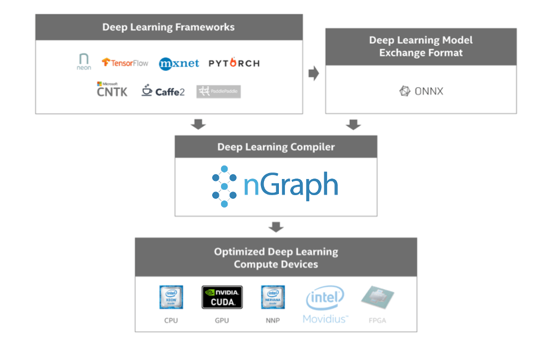

.. ---------------------------------------------------------------------------
.. Copyright 2018 Intel Corporation
.. Licensed under the Apache License, Version 2.0 (the "License");
.. you may not use this file except in compliance with the License.
.. You may obtain a copy of the License at
..
..      http://www.apache.org/licenses/LICENSE-2.0
..
.. Unless required by applicable law or agreed to in writing, software
.. distributed under the License is distributed on an "AS IS" BASIS,
.. WITHOUT WARRANTIES OR CONDITIONS OF ANY KIND, either express or implied.
.. See the License for the specific language governing permissions and
.. limitations under the License.
.. ---------------------------------------------------------------------------

.. This documentation is available online at 
.. http://ngraph.nervanasys.com/docs/latest/

########
nGraph™ 
########

Welcome to the nGraph™ documentation site. nGraph is an open-source C++ library 
and runtime / compiler suite for :abbr:`Deep Learning (DL)` ecosystems. Our goal 
is to empower algorithm designers, data scientists, framework architects, 
software engineers, and others with the means to make their work :ref:`portable`, 
:ref:`adaptable`, and :ref:`deployable` across the most modern 
:abbr:`Machine Learning (ML)` hardware available today: optimized Deep Learning
computation devices.

  

.. _portable:

Portable
========

One of nGraph's key features is **framework neutrality**. While we currently 
support :doc:`three popular <framework-integration-guides>` frameworks with 
pre-optimized deployment runtimes for training :abbr:`Deep Neural Network (DNN)`, 
models, you are not limited to these when choosing among frontends. Architects 
of any framework (even those not listed above) can use our documentation for how
to :doc:`compile and run <howto/execute>` a training model and design or tweak 
a framework to bridge directly to the nGraph compiler. With a *portable* model 
at the core of your :abbr:`DL (Deep Learning)` ecosystem, it's no longer 
necessary to bring large datasets to the model for training; you can take your 
model -- in whole, or in part -- to where the data lives and save potentially 
significant or quantifiable machine resources.  

.. _adaptable: 

Adaptable
=========

We've recently begun support for the `ONNX`_ format. Developers who already have 
a "trained" :abbr:`DNN (Deep Neural Network)` model can use nGraph to bypass 
significant framework-based complexity and :doc:`import it <howto/import>` 
to test or run on targeted and efficient backends with our user-friendly 
Python-based API. See the `ngraph onnx companion tool`_ to get started. 

.. csv-table::
   :header: "Framework", "Bridge Code Available?", "ONNX Support?"
   :widths: 27, 10, 10

   TensorFlow, Yes, Yes
   MXNet, Yes, Yes
   PaddlePaddle, Coming Soon, Yes
   neon, none needed, Yes
   PyTorch, Coming Soon, Yes
   CNTK, Not yet, Yes
   Other, Not yet, Doable

.. _deployable:

Deployable
==========

It's no secret that the :abbr:`DL (Deep Learning)` ecosystem is evolving 
rapidly. Benchmarking comparisons can be blown steeply out of proportion by 
subtle tweaks to batch or latency numbers here and there. Where traditional 
GPU-based training excels, inference can lag and vice versa. Sometimes what we
care about is not "speed at training a large dataset" but rather latency 
compiling a complex multi-layer algorithm locally, and then outputting back to 
an edge network, where it can be analyzed by an already-trained model. 

Indeed, when choosing among topologies, it is important to not lose sight of 
the ultimate deployability and machine-runtime demands of your component in
the larger ecosystem. It doesn't make sense to use a heavy-duty backhoe to 
plant a flower bulb. Furthermore, if you are trying to develop an entirely 
new genre of modeling for a :abbr:`DNN (Deep Neural Network)` component, it 
may be especially beneficial to consider ahead of time how portable and 
mobile you want that model to be within the rapidly-changing ecosystem.  
With nGraph, any modern CPU can be used to design, write, test, and deploy 
a training or inference model. You can then adapt and update that same core 
model to run on a variety of backends:  

.. csv-table::
   :header: "Backend", "Current nGraph support", "Future nGraph support"
   :widths: 35, 10, 10

   Intel® Architecture Processors (CPUs), Yes, Yes
   Intel® Nervana™ Neural Network Processor™ (NNPs), Yes, Yes
   NVIDIA\* CUDA (GPUs), Yes, Some 
   :abbr:`Field Programmable Gate Arrays (FPGA)` (FPGAs), Coming soon, Yes
   `Movidius`_, Not yet, Yes
   Other, Not yet, Ask

The value we're offering to the developer community is empowerment: we are
confident that Intel® Architecture already provides the best computational 
resources available for the breadth of ML/DL tasks.  We welcome ideas and 
`contributions`_ from the community.  

Further project details can be found on our :doc:`project/about` page, or see 
our :doc:`install` guide for how to get started.   

.. note:: The library code is under active development as we're continually 
   adding support for more kinds of DL models and ops, framework compiler 
   optimizations, and backends. 

=======

Contents
========

.. toctree::
   :maxdepth: 1
   :name: tocmaster
   :caption: Documentation

   install.rst
   graph-basics.rst
   fusion/index.rst
   howto/index.rst
   ops/index.rst
   framework-integration-guides.rst
   frameworks/index.rst
   programmable/index.rst
   distr/index.rst
   python_api/index.rst
   project/index.rst

Indices and tables
==================

   * :ref:`search`   
   * :ref:`genindex`

     
.. _ONNX:  http://onnx.ai
.. _ngraph onnx companion tool: https://github.com/NervanaSystems/ngraph-onnx
.. _Movidius: https://www.movidius.com/
.. _contributions: https://github.com/NervanaSystems/ngraph#how-to-contribute
  
