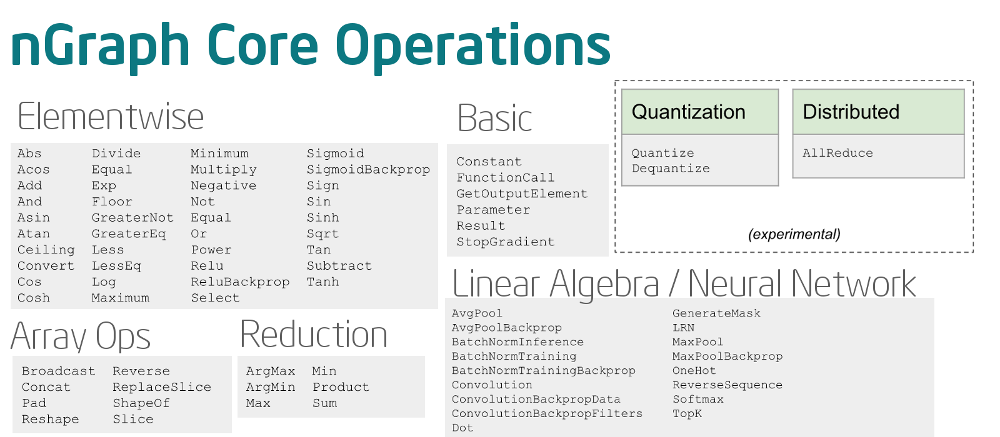

.. ops/about.rst: 

##############
About Core Ops
##############

An ``Op``'s primary role is to function as a node in a directed acyclic graph 
dependency computation graph.  

*Core ops* are ops that are available and generally useful to all framework 
bridges and that can be compiled by all transformers. A framework bridge may 
define framework-specific ops to simplify graph construction, provided that the 
bridge can enable every transformer to replace all such ops with equivalent 
clusters or subgraphs composed of core ops. Similary, transformers may define 
transformer-specific ops to represent kernels or other intermediate operations. 

If a framework supports extending the set of ops it offers, a bridge may even 
expose transformer-specific ops to the framework user.

    Operations Available in the nGraph IR

.. important:: Our design philosophy is that the graph is not a script for 
   running kernels; rather, our compilation will match ``ops`` to appropriate 
   kernels for the backend(s) in use. Thus, we expect that adding of new Core 
   ops should be infrequent and that most functionality instead gets added with 
   new functions that build sub-graphs from existing core ops.   

It is easiest to define a new op by adapting an existing op. Some of the tasks 
that must be performed are:

- Op constructor:

  * Checking type-consistency of arguments 
  * Specifying the result type for a call 

- Serializer/Deserializer

- Transformer handlers:

  * Interpreter (reference) implementation of behavior. The
    implementation should favor clarity over efficiency.
