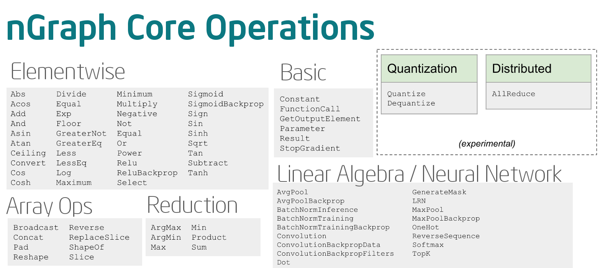

   .. ops/index.rst

####################
List of Core ``ops``
####################

Not currently a comprehensive list.  

:ref:`more_about`

.. hlist:: 
   :columns: 3

   * :doc:`abs`
   * :doc:`acos`
   * :doc:`add`
   * :doc:`all`
   * :doc:`allreduce`
   * :doc:`and`
   * :doc:`any`
   * :doc:`asin`
   * :doc:`atan`
   * :doc:`avg_pool`
   * :doc:`avg_pool_backprop`
   * :doc:`batch_norm_inference`
   * :doc:`batch_norm_training`
   * :doc:`batch_norm_training_backprop`
   * :doc:`broadcast`
   * :doc:`broadcast_distributed`
   * :doc:`ceiling`
   * :doc:`concat`
   * :doc:`constant`
   * :doc:`convert`
   * :doc:`convolution`
   * :doc:`cos`
   * :doc:`cosh`
   * :doc:`dequantize`
   * :doc:`divide`
   * :doc:`dot`
   * :doc:`drop_out`
   * :doc:`equal`
   * :doc:`exp`
   * :doc:`floor`
   * :doc:`get_output_element`
   * :doc:`greater_eq`
   * :doc:`greater`
   * :doc:`less_eq`
   * :doc:`less`
   * :doc:`log`
   * :doc:`max`
   * :doc:`maximum`
   * :doc:`max_pool` 
   * :doc:`min`
   * :doc:`minimum`
   * :doc:`multiply`
   * :doc:`negative`
   * :doc:`not_equal`
   * :doc:`not`
   * :doc:`one_hot`
   * :doc:`or`
   * :doc:`pad`
   * :doc:`parameter`
   * :doc:`power`
   * :doc:`product`
   * :doc:`quantize`
   * :doc:`relu`
   * :doc:`result`
   * :doc:`shape_of`
   * :doc:`sigmoid`
   * :doc:`sign`
   * :doc:`sin`
   * :doc:`sinh`
   * :doc:`slice`
   * :doc:`softmax`
   * :doc:`sqrt`
   * :doc:`subtract`
   * :doc:`tan`
   * :doc:`tanh`
   * :doc:`transpose`
   * :doc:`xor`

.. toctree::
   :hidden:

   abs.rst
   acos.rst
   add.rst
   all.rst
   allreduce.rst
   and.rst
   any.rst
   asin.rst
   atan.rst
   avg_pool.rst
   avg_pool_backprop.rst
   batch_norm_inference.rst
   batch_norm_training.rst
   batch_norm_training_backprop.rst
   broadcast.rst
   broadcast_distributed.rst
   ceiling.rst
   concat.rst
   constant.rst
   convert.rst
   convolution.rst
   cos.rst
   cosh.rst
   dequantize.rst
   divide.rst
   dot.rst
   drop_out.rst
   equal.rst
   exp.rst
   floor.rst
   get_output_element.rst
   greater_eq.rst
   greater.rst
   less_eq.rst
   less.rst
   log.rst
   max.rst
   maximum.rst
   max_pool.rst 
   min.rst
   minimum.rst
   multiply.rst
   negative.rst
   not_equal.rst
   not.rst
   one_hot.rst
   or.rst
   pad.rst
   parameter.rst
   power.rst
   product.rst
   quantize.rst
   relu.rst
   result.rst
   shape_of.rst
   sigmoid.rst
   sign.rst
   sin.rst
   sinh.rst
   slice.rst
   softmax.rst
   sqrt.rst
   subtract.rst
   tan.rst
   tanh.rst
   transpose.rst
   xor.rst

.. _more_about: 

More about Core Ops
-------------------

An ``Op``'s primary role is to function as a node in a directed acyclic graph 
dependency computation graph.  

*Core ops* are ops that are available and generally useful to all framework 
bridges and that can be compiled by all transformers. A framework bridge may 
define framework-specific ops to simplify graph construction, provided that the 
bridge can enable every transformer to replace all such ops with equivalent 
clusters or subgraphs composed of core ops. In a similar manner, transformers may define 
transformer-specific ops to represent kernels or other intermediate operations. 

If a framework supports extending the set of ops it offers, a bridge may even 
expose transformer-specific ops to the framework user.

    Operations Available in the nGraph IR

.. important:: Our design philosophy is that the graph is not a script for 
   running kernels; rather, our compilation will match ``ops`` to appropriate 
   kernels for the backend(s) in use. Thus, we expect that adding of new Core 
   ops should be infrequent and that most functionality instead gets added with 
   new functions that build sub-graphs from existing core ops.

It is easiest to define a new op by adapting an existing op. Some of the tasks 
that must be performed are:

- Op constructor:

  * Checking type-consistency of arguments 
  * Specifying the result type for a call 

- Serializer/Deserializer

- Transformer handlers:

  * Interpreter (reference) implementation of behavior. The
    implementation should favor clarity over efficiency.
