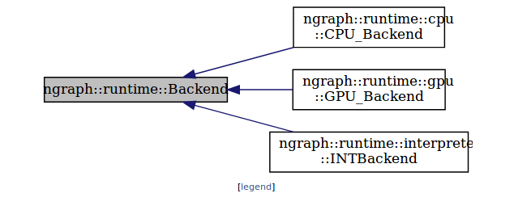

.. index.rst

#######################
Interact with Backends 
#######################

Backend
========

Backends are responsible for function execution and value allocation. They 
can be used to :doc:`carry out a programmed computation<../howto/execute>`
from a framework by using a CPU or GPU; or they can be used with an *Interpreter* 
mode, which is primarily intended for testing, to analyze a program, or for a 
framework developer to develop a custom UI or API. 

.. doxygenclass:: ngraph::runtime::Backend
   :project: ngraph
   :members:

TensorView
===========

.. doxygenclass:: ngraph::runtime::TensorView
   :project: ngraph
   :members:

