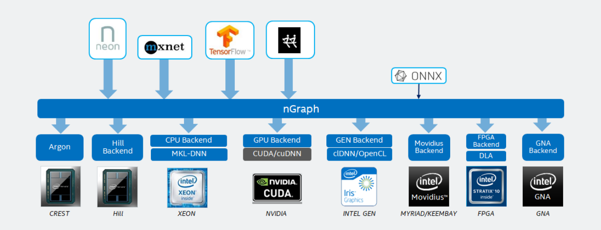

.. about: 

Overview
========

Welcome to the documentation site for |InG|, an open-source C++ Compiler, 
Library, and runtime suite for running training and inference on 
:abbr:`Deep Neural Network (DNN)` models. nGraph is framework-neutral and can be 
targeted for programming and deploying :abbr:`Deep Learning (DL)` applications 
on the most modern compute and edge devices.   

Features
--------

:ref:`no-lockin`
:ref:`framework-flexibility`

.. _no-lockin:

Develop without lock-in
~~~~~~~~~~~~~~~~~~~~~~~

  

Being able to increase training performance or reduce inference latency by simply 
adding another device of *any* specialized form factor -- whether it be more 
compute (CPU), GPU or VPU processing power, custom ASIC or FPGA, or a yet-to-be 
invented generation of NNP or accelerator -- is a key benefit for frameworks 
developers working with nGraph. Our commitment to bake flexibility into our 
ecosystem ensures developers' freedom to design user-facing APIs for various 
hardware deployments directly into their frameworks. 

.. figure:: ../graphics/ngraph-ecosystem.png
   :width: 585px   
  
nGraph currently supports :doc:`three popular <../framework-integration-guides>` 
frameworks for :abbr:`Deep Learning (DL)` models through what we call 
a :term:`bridge` that can be integrated during the framework's build time. 
For developers working with other frameworks (even those not listed above), 
we've created a :doc:`How to Guide <../howto/index>` so you can learn how to 
create custom bridge code that can be used to 
:doc:`compile and run <../howto/execute>` a training model.  

Additionally, nGraph Library supports the `ONNX`_ format. Developers who 
already have a "trained" model can use nGraph to bypass much of the 
framework-based complexity and :doc:`../howto/import` to test or run it 
on targeted and efficient backends with our user-friendly ``ngraph_api``. 
With nGraph, data scientists can focus on data science rather than worrying 
about how to adapt models to train and run efficiently on different devices. 
Be sure to add the ``-DNGRAPH_ONNX_IMPORT_ENABLE=ON`` option when running `cmake`
to build the Library. 

Supported platforms
--------------------

* Intel® Architecture Processors (CPUs), 
* Intel® Nervana™ Neural Network Processor™ (NNPs), and 
* NVIDIA\* CUDA (GPUs). 

We built the first-generation of the Intel Nervana™ NNP family of processors 
last year to show that the nGraph Library can be used to train a
:abbr:`Neural Network (NN)` more quickly. The more advanced the silicon, the 
more powerful a lightweight a library can be. So while we do currently support 
traditional GPUs, they are not advanced silicon, and trying to scale workloads 
using traditional GPU libraries is clunky and brittle with bottlenecks. Iteration 
from an already-trained NN model to one that can also perform inference 
computations is immensely simplified. Read more about these compute-friendly 
options on the documentation for :doc:`../fusion/index`.  

.. note:: The library code is under active development as we're continually 
   adding support for more kinds of DL models and ops, framework compiler 
   optimizations, and backends. 

Why was this needed?
---------------------

When Deep Learning (DL) frameworks first emerged as the vehicle for training 
models, they were designed around kernels optimized for a particular platform. 
As a result, many backend details were being exposed in the model definitions, 
making the adaptability and portability of DL models to other, or more advanced 
backends complex and expensive.

The traditional approach means that an algorithm developer cannot easily adapt 
his or her model to different backends. Making a model run on a different 
framework is also problematic because the user must separate the essence of 
the model from the performance adjustments made for the backend, translate 
to similar ops in the new framework, and finally make the necessary changes 
for the preferred backend configuration on the new framework.

We designed the Intel nGraph project to substantially reduce these kinds of 
engineering complexities. Our compiler-inspired approach means that developers 
have fewer constraints imposed by frameworks when working with their models; 
they can pick and choose only the components they need to build custom algorithms 
for advanced deep learning tasks. Furthermore, if working with a model that is 
already trained (or close to being trained), or if they wish to pivot and add a 
new layer to an existing model, the data scientist can :doc:`../howto/import` 
and start working with :doc:`../ops/index` more quickly. 

How does it work?
------------------

The *nGraph core* uses a **strongly-typed and platform-neutral stateless graph 
representation** for computations. Each node, or *op*, in the graph corresponds
to one :term:`step` in a computation, where each step produces zero or more 
tensor outputs from zero or more tensor inputs. For a more detailed dive into 
how this works, read our documentation on how to :doc:`../howto/execute`.

.. _framework-flexibility:

How do I connect it to a framework? 
------------------------------------

Currently, we offer *framework bridges* for some of the more widely-known 
:doc:`frameworks <../framework-integration-guides>`. The bridge acts as an 
intermediary between the *ngraph core* and the framework, providing a means 
to use various execution platforms. The result is a function that can be 
executed from the framework bridge.

Given that we have no way to predict how many more frameworks might be invented
for either model or framework-specific purposes, it would be nearly impossible 
for us to create bridges for every framework that currently exists (or that will 
exist in the future). Thus, the library provides a way for developers to write 
or contribute "bridge code" for various frameworks.  We welcome such 
contributions from the DL community.

How do I connect a DL training or inference model to nGraph?
-------------------------------------------------------------

Framework bridge code is *not* the only way to connect a model (function graph) 
to nGraph's :doc:`../ops/index`. We've also built an importer for models that 
have been exported from a framework and saved as serialized file, such as ONNX. 
To learn how to convert such serialized files to an nGraph model, please see 
the :doc:`../howto/import` documentation.  

What's next?
-------------
  
We developed nGraph to simplify the realization of optimized deep learning 
performance across frameworks and hardware platforms. You can read more about 
design decisions and what is tentatively in the pipeline for development in 
our `arXiv paper`_ from the 2018 SysML conference.

.. _arXiv paper: https://arxiv.org/pdf/1801.08058.pdf
.. _ONNX: http://onnx.ai 
.. _Intel® MKL-DNN: https://github.com/intel/mkl-dnn
.. _Movidius: https://developer.movidius.com/
