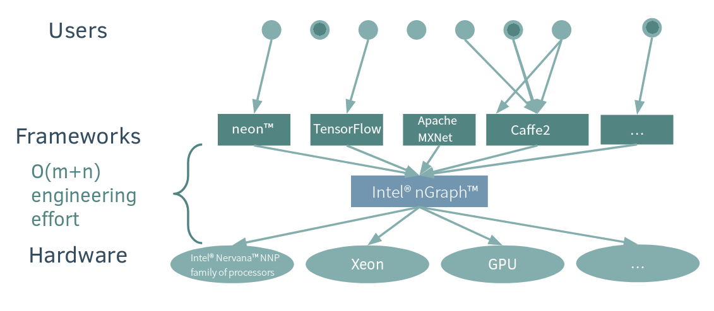

.. about: 

About
=====

Welcome to the Intel nGraph project, an open source C++ library for developers
of :abbr:`Deep Learning (DL)` (DL) systems. Here you will find a suite of 
components, APIs, and documentation that can be used to compile and run  
:abbr:`Deep Neural Network (DNN)` models defined in a variety of frameworks.  

The nGraph library translates a framework’s representation of computations into 
an :abbr:`Intermediate Representation (IR)` designed to promote computational 
efficiency on target hardware. Initially-supported backends include Intel 
Architecture CPUs, the Intel® Nervana Neural Network Processor™ (NNP), 
and NVIDIA\* GPUs. Currently-supported compiler optimizations include efficient 
memory management and data layout abstraction. 

Why is this needed?
--------------------

When Deep Learning (DL) frameworks first emerged as the vehicle for training and
inference models, they were designed around kernels optimized for a particular 
platform. As a result, many backend details -- which normally should get 
encapsulated within the kernel-framework implementation -- instead get muddied 
up in the framework's language, and sometimes even in the the model itself. This 
makes the adaptability and portability of DL models to different frameworks or 
backends inherently complex and expensive. 

This problem remains largely unchanged today: an algorithm writer cannot easily 
adapt her or his model to other frameworks. Nor does the traditional approach 
allow the freedom to experiment or test a model with different backends or on 
better hardware; teams get locked into a framework and their model either has 
to be entirely rewritten for the new framework, or re-optimized with the newer 
hardware and kernel in mind. Furthermore, any hard-earned optimizations of the 
model (usually focused on only one aspect, such as training performance) from 
its original topology break with a change, update, or upgrade to the platform.

We designed the Intel nGraph project to reduce these kinds of engineering 
complexities. While optimized kernels for deep-learning primitives are provided 
via libraries like Intel® Math Kernel Library for Deep Neural Networks (Intel
MKL-DNN), there are also several compiler-inspired ways in which performance 
can be further optimized. 

=======

The *nGraph core* uses a strongly-typed and platform-neutral stateless graph 
representation for computations. Each node, or *op*, in the graph corresponds
to one step in a computation, where each step produces zero or more tensor
outputs from zero or more tensor inputs.

There is a *framework bridge* for each supported framework which acts as 
an intermediary between the *ngraph core* and the framework. A *transformer* 
plays a similar role between the ngraph core and the various execution 
platforms.

Transformers compile the graph using a combination of generic and 
platform-specific graph transformations. The result is a function that
can be executed from the framework bridge. Transformers also allocate
and deallocate, as well as read and write tensors under direction of the
bridge.
  
We developed Intel nGraph to simplify the realization of optimized deep 
learning performance across frameworks and hardware platforms. You can
read more about design decisions and what is tentatively in the pipeline
for development in our `SysML conference paper`_.

.. _frontend: http://neon.nervanasys.com/index.html/
.. _SysML conference paper: https://arxiv.org/pdf/1801.08058.pdf
.. _MXNet: http://mxnet.incubator.apache.org/
.. _TensorFlow: https://www.tensorflow.org/

