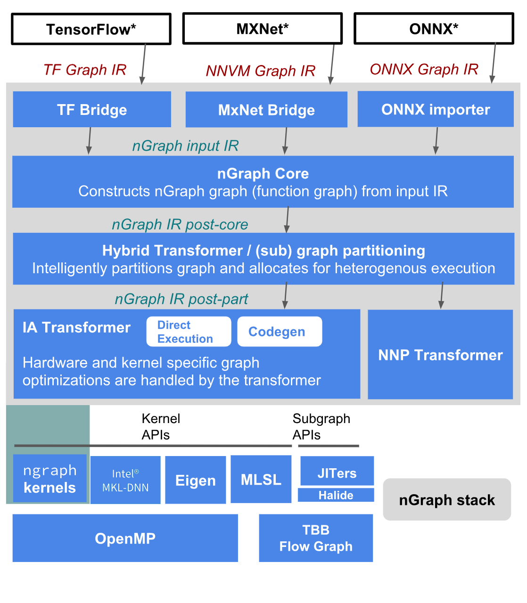
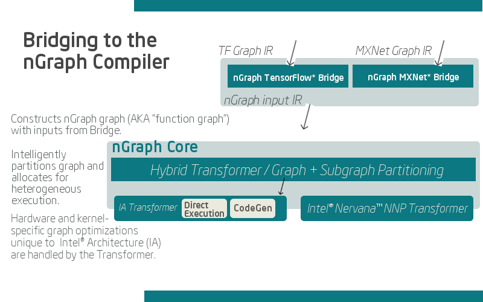

.. about: 

Architecture, Features, FAQs
############################

* :ref:`architecture`
* :ref:`features`
* :ref:`faq`
* :ref:`whats_next`

.. _architecture:

nGraph Compiler stack architecture
==================================

The diagram below represents our current Beta release stack. In the
diagram, nGraph components are colored in gray. Please note that the
stack diagram is simplified to show how nGraph executes deep learning
workloads with two hardware backends; however, many other deep learning
frameworks and backends currently are functioning.

Bridge
------

Starting from the top of the stack, nGraph receives a computational
graph from a deep learning framework such as TensorFlow\* or MXNet\*.
The computational graph is converted to an nGraph internal
representation by a bridge created for the corresponding framework.

An nGraph bridge examines the whole graph to pattern match subgraphs
which nGraph knows how to execute, and these subgraphs are encapsulated.
Parts of the graph that are not encapsulated will default to framework
implementation when executed.

nGraph Core
-----------

nGraph uses a strongly-typed and platform-neutral
``Intermediate Representation (IR)`` to construct a "stateless"
computational graph. Each node, or op, in the graph corresponds to one
``step`` in a computation, where each step produces zero or more tensor
outputs from zero or more tensor inputs.

This allows nGraph to apply its state of the art optimizations instead
of having to follow how a particular framework implements op execution,
memory management, data layouts, etc.

In addition, using nGraph IR allows faster optimization delivery for
many of the supported frameworks. For example, if nGraph optimizes
ResNet\* for TensorFlow\ *, the same optimization can be readily applied
to MXNet* or ONNX\* implementations of ResNet\*.

Hybrid Transformer
------------------

Hybrid transformer takes the nGraph IR, and partitions it into
subgraphs, which can then be assigned to the best-performing backend.
There are two hardware backends shown in the stack diagram to
demonstrate this graph partitioning. The Hybrid transformer assigns
complex operations (subgraphs) to Intel® Nervana™ Neural Network
Processor (NNP) to expedite the computation, and the remaining
operations default to CPU. In the future, we will further expand the
capabilities of Hybrid transformer by enabling more features, such as
localized cost modeling and memory sharing.

Once the subgraphs are assigned, the corresponding backend will execute
the IR.

Backends
--------

Focusing our attention on the CPU backend, when the IR is passed to the
Intel® Architecture (IA) transformer, it can be executed in two modes:
Direct EXecution (DEX) and code generation (``codegen``).

In ``codegen`` mode, nGraph generates and compiles code which can either
call into highly optimized kernels like MKL-DNN or JITers like Halide.
Although our team wrote kernels for nGraph for some operations, nGraph
leverages existing kernel libraries such as MKL-DNN, Eigen, and MLSL.

MLSL library is called when nGraph executes distributed training. At the
time of the nGraph Beta release, nGraph achieved state of the art
results for ResNet50 with 16 nodes and 32 nodes for TensorFlow\* and
MXNet\*. We are excited to continue our work in enabling distributed
training, and we plan to expand to 256 nodes in Q4 ‘18. Additionally, we
are testing model parallelism in addition to data parallelism.

The other mode of execution is Direct EXecution (DEX). In DEX mode,
nGraph can execute the operations by directly calling associated kernels
as it walks though the IR instead of compiling via ``codegen``. This
mode reduces the compilation time, and it will be useful for training,
deploying, and retraining a deep learning workload in production. In our
tests, DEX mode reduced ResNet50 compilation time by 30X.

nGraph further tries to speed up the computation by leveraging
multi-threading and graph scheduling libraries such as OpenMP and TBB
Flow Graph.

.. _features:

Features
########

nGraph performs a combination of device-specific and non-device-specific
optimizations:

-  **Fusion** -- Fuse multiple ops to to decrease memory usage.
-  **Data layout abstraction** -- Make abstraction easier and faster
   with nGraph translating element order to work best for a given or
   available device.
-  **Data reuse** -- Save results and reuse for subgraphs with the same
   input.
-  **Graph scheduling** -- Run similar subgraphs in parallel via
   multi-threading.
-  **Graph partitioning** -- Partition subgraphs to run on different
   devices to speed up computation; make better use of spare CPU cycles
   with nGraph.
-  **Memory management** -- Prevent peak memory usage by intercepting a
   graph with or by a "saved checkpoint," and to enable data auditing.
-  **Data layout abstraction** -- Make abstraction easier and faster
   with nGraph translating element order to work best for whatever given
   or available device.

.. _faq:

FAQs
####

Why nGraph? 
===========

The value we're offering to the developer community is empowerment: we are 
confident that Intel® Architecture already provides the best computational 
resources available for the breadth of ML/DL tasks. 

How does it work?
=================

The :doc:`nGraph Core <../ops/index>` uses a **strongly-typed** and 
**platform-neutral** :abbr:`Intermediate Representation (IR)` to construct a 
"stateless" graph. Each node, or *op*, in the graph corresponds to one 
:term:`step` in a computation, where each step produces zero or more tensor 
outputs from zero or more tensor inputs. 

How do I connect a framework? 
=============================

The nGraph Library manages framework bridges for some of the more widely-known 
frameworks. A bridge acts as an intermediary between the nGraph core and the 
framework, and the result is a function that can be compiled from a framework. 
A fully-compiled function that makes use of bridge code thus becomes a "function
graph", or what we sometimes call an **nGraph graph**.  

.. important:: See :doc:`../ops/index` to learn about Core Ops.

Our design philosophy is that the graph is not a script for running kernels; 
rather, our compilation will match ``ops`` to appropriate available kernels
(or when available, such as with CPU cycles). Thus, we expect that adding of 
new Core ops should be infrequent and that most functionality instead gets 
added with new functions that build sub-graphs from existing core ops.   

For a more detailed dive into how custom bridge code can be implemented, see our 
documentation on how to :doc:`../howto/execute`. To learn how TensorFlow and 
MXNet currently make use of custom bridge code, see the section on 
:doc:`../frameworks/index`.

    JiT Compiling for computation

How do I run an inference model?
================================

Framework bridge code is *not* the only way to connect a model (function graph) 
to nGraph's :doc:`../ops/index`. We've also built an importer for models that 
have been exported from a framework and saved as serialized file, such as ONNX. 
To learn how to convert such serialized files to an nGraph model, please see 
the :doc:`../howto/import` documentation.  

.. _whats_next:

What's next?
############
  
We developed nGraph to simplify the realization of optimized deep learning 
performance across frameworks and hardware platforms. You can read more about 
design decisions and what is tentatively in the pipeline for development in 
our `arXiv paper`_ from the 2018 SysML conference.

.. _arXiv paper: https://arxiv.org/pdf/1801.08058.pdf
.. _ONNX: http://onnx.ai
.. _NNVM: https://github.com/dmlc/nnvm
.. _nGraph ONNX companion tool: https://github.com/NervanaSystems/ngraph-onnx
.. _Intel® MKL-DNN: https://github.com/intel/mkl-dnn
.. _Movidius: https://developer.movidius.com/

