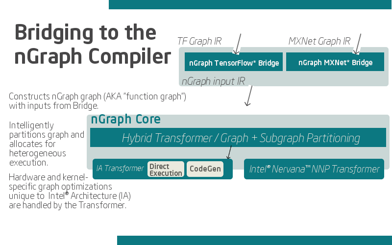

.. about: 

About Features, FAQs
####################

* :ref:`features`
* :ref:`faq`
* :ref:`whats_next`

.. _features:

Features
========

The nGraph :abbr:`Intermediate Representation (IR)` contains a combination of 
device-specific and non device-specific optimization and compilations to  
enable:

* **Fusion** -- Fuse multiple ``ops`` to to decrease memory usage "localities". 
* **Memory management** -- Prevent peak memory usage by intercepting a graph 
  with or by a "saved checkpoint," and to enable data auditing. 
* **Data reuse** -- Save result and reuse for subgraphs with the same input
* **Graph scheduling** -- Run similar subgraphs in parallel 
* **Graph partitioning** -- Partition subgraphs to run on different devices to 
  speed up computation.
* :abbr:`Direct EXecution mode (DEX)` or **DEX** -- Execute kernels for the 
  op directly instead of using codegen when traversing the computation graph.

  .. important:: See :doc:`../ops/index` to learn the nGraph means for graph 
     computations.

.. Our design philosophy is that the graph is not a script for running kernels; 
   rather, our compilation will match ``ops`` to appropriate available kernels
   (or when available, such as with CPU cycles). Thus, we expect that adding of 
   new Core ops should be infrequent and that most functionality instead gets 
   added with new functions that build sub-graphs from existing core ops.   

* **Data layout abstraction** -- Make abstraction easier and faster with nGraph 
  translating element order to work best for whatever given or available device.  

.. _portable:

Portable
--------

One of nGraph's key features is **framework neutrality**. While we currently 
support :doc:`three popular <../framework-integration-guides>` frameworks with 
pre-optimized deployment runtimes for training :abbr:`Deep Neural Network (DNN)`, 
models, you are not limited to these when choosing among frontends. Architects 
of any framework (even those not listed above) can use our documentation for how
to :doc:`compile and run <../howto/execute>` a training model and design or tweak 
a framework to bridge directly to the nGraph compiler. With a *portable* model 
at the core of your :abbr:`DL (Deep Learning)` ecosystem, it's no longer necessary 
to bring large datasets to the model for training; you can take your model -- in 
whole, or in part -- to where the data lives and save potentially significant 
or quantifiable machine resources.  

.. _adaptable: 

Adaptable
---------

We've recently begun support for the `ONNX`_ format. Developers who already have 
a "trained" :abbr:`DNN (Deep Neural Network)` model can use nGraph to bypass 
significant framework-based complexity and :doc:`import it <../howto/import>` 
to test or run on targeted and efficient backends with our user-friendly 
Python-based API. See the `ngraph onnx companion tool`_ to get started. 

.. _deployable:

Deployable
----------

It's no secret that the :abbr:`DL (Deep Learning)` ecosystem is evolving 
rapidly. Benchmarking comparisons can be blown steeply out of proportion by 
subtle tweaks to batch or latency numbers here and there. Where traditional 
GPU-based training excels, inference can lag and vice versa. Sometimes what we
care about is not "speed at training a large dataset" but rather latency 
compiling a complex multi-layer algorithm locally, and then outputting back to 
an edge network, where it can be analyzed by an already-trained model. 

Indeed, when choosing among topologies, it is important to not lose sight of 
the ultimate deployability and machine-runtime demands of your component in
the larger ecosystem. It doesn't make sense to use a heavy-duty backhoe to 
plant a flower bulb. Furthermore, if you are trying to develop an entirely 
new genre of modeling for a :abbr:`DNN (Deep Neural Network)` component, it 
may be especially beneficial to consider ahead of time how portable and 
mobile you want that model to be within the rapidly-changing ecosystem.  
With nGraph, any modern CPU can be used to design, write, test, and deploy 
a training or inference model. You can then adapt and update that same core 
model to run on a variety of backends  

.. _no-lockin:

Develop without lock-in
-----------------------

Being able to increase training performance or reduce inference latency by 
simply adding another device of *any* form factor -- more compute (CPU), GPU or 
VPU processing power, custom ASIC or FPGA, or a yet-to-be invented generation of 
NNP or accelerator -- is a key benefit for framework developers building with 
nGraph. Our commitment to bake flexibility into our ecosystem ensures developers' 
freedom to design user-facing APIs for various hardware deployments directly 
into their frameworks. 

.. figure:: ../graphics/develop-without-lockin.png

The value we're offering to the developer community is empowerment: we are 
confident that Intel® Architecture already provides the best computational 
resources available for the breadth of ML/DL tasks. 

.. _faq:

FAQs
=====

How does it work?
------------------

The :doc:`nGraph Core <../ops/index>` uses a **strongly-typed** and 
**platform-neutral** :abbr:`Intermediate Representation (IR)` to construct a 
"stateless" graph. Each node, or *op*, in the graph corresponds to one 
:term:`step` in a computation, where each step produces zero or more tensor 
outputs from zero or more tensor inputs. 

How do I connect a framework? 
-----------------------------

The nGraph Library manages framework bridges for some of the more widely-known 
frameworks. A bridge acts as an intermediary between the nGraph core and the 
framework, and the result is a function that can be compiled from a framework. 
A fully-compiled function that makes use of bridge code thus becomes a "function
graph", or what we sometimes call an **nGraph graph**.  

.. note:: Low-level nGraph APIs are not accessible *dynamically* via bridge code;
   this is the nature of stateless graphs. However, do note that a graph with a 
   "saved" checkpoint can be "continued" to run from a previously-applied 
   checkpoint, or it can loaded as static graph for further inspection.

For a more detailed dive into how custom bridge code can be implemented, see our 
documentation on how to :doc:`../howto/execute`. To learn how TensorFlow and 
MXNet currently make use of custom bridge code, see the section on 
:doc:`../framework-integration-guides`.

    JiT Compiling for computation

Given that we have no way to predict how many other frameworks designed around 
model, workload, or framework-specific purposes there may be, it would be  
impossible for us to create bridges for every framework that currently exists 
(or that will exist in the future). Although we only support a few frameworks, 
we provide documentation to help developers and engineers figure out how to 
get custom solutions working, such as for edge cases. 

.. csv-table::
   :header: "Framework", "Bridge Available?", "ONNX Support?"
   :widths: 27, 10, 10

   TensorFlow, Yes, Yes
   MXNet, Yes, Yes
   PaddlePaddle, Coming Soon, Yes
   PyTorch, No, Yes
   Other, Write your own, Custom

How do I run an inference model?
--------------------------------

Framework bridge code is *not* the only way to connect a model (function graph) 
to nGraph's :doc:`../ops/index`. We've also built an importer for models that 
have been exported from a framework and saved as serialized file, such as ONNX. 
To learn how to convert such serialized files to an nGraph model, please see 
the :doc:`../howto/import` documentation.  

.. _whats_next:

What's next?
============
  
We developed nGraph to simplify the realization of optimized deep learning 
performance across frameworks and hardware platforms. You can read more about 
design decisions and what is tentatively in the pipeline for development in 
our `arXiv paper`_ from the 2018 SysML conference.

.. _arXiv paper: https://arxiv.org/pdf/1801.08058.pdf
.. _ONNX: http://onnx.ai 
.. _nGraph ONNX companion tool: https://github.com/NervanaSystems/ngraph-onnx
.. _Intel® MKL-DNN: https://github.com/intel/mkl-dnn
.. _Movidius: https://developer.movidius.com/

