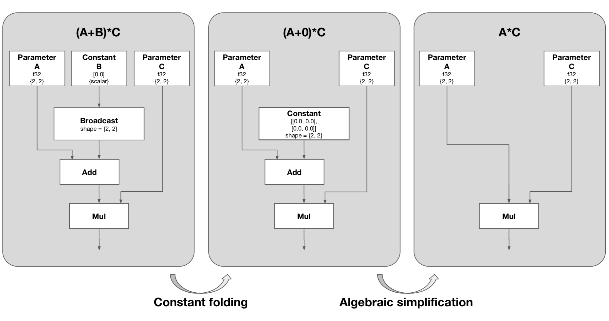
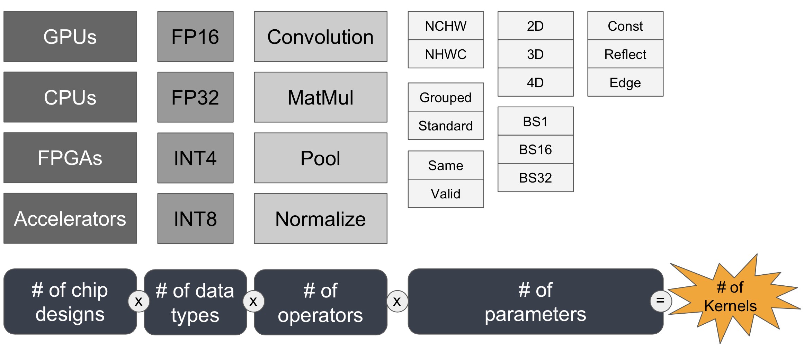

.. project/introduction.rst:

#######
Summary
#######

nGraph is an open-source graph compiler for :abbr:`Artificial Neural Networks (ANNs)`. 
The nGraph Compiler stack provides an inherently efficient graph-based compilation 
infrastructure designed to be compatible with many upcoming 
:abbr:`Application-Specific Integrated Circuits (ASICs)`, like the Intel® Nervana™ 
Neural Network Processor (Intel® Nervana™ NNP), while also unlocking a massive 
performance boost on any existing hardware targets for your neural network: both 
GPUs and CPUs. Using its flexible infrastructure, you will find it becomes much 
easier to create Deep Learning (DL) models that can adhere to the "write once, 
run anywhere" mantra that enables your AI solutions to easily go from concept to 
production to scale.

Frameworks using nGraph to execute workloads have shown `up to 45X`_ performance 
boost compared to native implementations. 

For a detailed overview, see below; for a more historical perspective, see 
our `arXiv`_ paper.

Motivations
===========

Developers working to craft solutions with :abbr:`Artificial Intelligence (AI)`
face a steep learning curve in taking their concepts from design to 
production. It can be challenging to create a :abbr:`Deep Learning (DL)` model 
that maintains a minimum standard of consistency, as it must be continually 
tweaked, adapted, or rewritten to use and optimize various parts of the stack 
during its life cycle. For DL models that do reach production-ready status, an 
entirely new set of problems emerges in how to scale and use larger and larger 
datasets, data that must be encrypted, data-in-motion, and of course, in 
finding the best compromises among speed, accuracy, and performance.  

Two general approaches to advancing deep learning performance dominate the 
industry today. The first is to design hardware dedicated exclusively to 
handling compute for specialized kinds of :abbr:`Machine Learning (ML)` or 
:abbr:`DL (Deep Learning)` operations; this approach essentially designs a 
custom network infrastructure *around* specific problems AI is supposed to 
solve. For example, many companies are actively developing specialized 
:abbr:`Application-Specific Integrated Circuits (ASICs)` to speed-up 
training (one kind of ASIC) or to reduce inference latency (another kind 
of ASIC) in their cloud-based or local data centers. This approach works 
great for :abbr:`Cloud Service Providers (CSPs)` and others that have 
considerable budgets to invest in researching and building new hardware; 
however, it creates a significant burden on the developer who needs to 
invest in adapting the context of their model for training and then for 
inference, to figure out at least two data-cycle pipelines or deployment 
scenarios, and to decide what trade-offs to make when and where.  

The second approach to making deep learning more efficient is to design a  
software stack that lets the :abbr:`Neural Network (NN)` adapt to whatever 
compute resources are available and deliver performance via software 
optimization. The nGraph Compiler stack is our solution to this second 
approach: it provides an inherently efficient graph-based compilation 
infrastructure designed to be compatible with many upcoming DL ASICs while 
also unlocking a massive performance boost on any existing hardware targets 
in a network, whether they are CPUs, GPUs, or other custom silicon. nGraph 
provides optimization opportunities at the graph level, where the 
network-to-device compilation can be managed with a series of "subgraphs"
that can be handled in either a static or a dynamic manner. With our 
:doc:`../ops/index` and graph-based infrastructure for neural networks, 
it's also possible to extract context semantics that make it much easier to 
work with many of the new and emerging problems in Deep Learning including 
larger datasets, data that must be encrypted, and data-in-motion. Our solution 
also addresses the scalability issue with kernel libraries, the current 
popular solution to accelerating deep learning performance. 

The current state-of-the-art software solution for speeding up deep learning 
computation is to integrate kernel libraries like Intel® Math Kernel Library 
for Deep Neural Networks (Intel® MKL DNN) and Nvidia\*'s CuDNN into deep 
learning frameworks. These kernel libraries offer a runtime performance boost 
on specific hardware targets through highly-optimized kernels and other 
operator-level optimizations.

However, kernel libraries have three main problems: 

#. Kernel libraries do not support graph-level optimizations.
#. Framework integration of kernel libraries does not scale.
#. There are too many kernels to write, and they require expert knowledge.

The nGraph Compiler stack is designed to address the first two problems. nGraph 
applies graph-level optimizations by taking the computational graph from a deep 
learning framework like TensorFlow\* and reconstructing it with the nGraph 
:abbr:`Intermediate Representation (IR)`. The nGraph IR centralizes computational 
graphs from various frameworks and provides a unified way to connect backends 
for targeted hardware. From here, PlaidML or one of the nGraph transformers can 
generate code in various forms, including LLVM, OpenCL, OpenGL, Cuda and Metal. 
This generated code is where the low-level optimizations are automatically 
applied.  The result is a more efficient execution that does not require any 
manual kernel integration work for most hardware targets. 

What follows here is more detail about how our solution addresses these 
problems. 

Problem: Absence of graph-level optimizations
---------------------------------------------

The diagram below illustrates a simple example of how a deep learning 
framework, when integrated with a kernel library, is capable of running each 
operation in a computational graph optimally, but the graph itself may not be 
optimal: 

.. _figure-A:

The computation is constructed to execute ``(A+B)*C``, but in the context of 
nGraph, we can further optimize the graph to be represented as ``A*C``. From the 
first graph shown on the left, the operation on the constant ``B`` can be 
computed at the compile time (known as constant folding), and the graph can be 
further simplified to the one on the right because the constant has value of 
zero. Without such graph-level optimizations, a deep learning framework with a 
kernel library will compute all operations, and the resulting execution will be 
suboptimal. 

Problem: Reduced scalability 
----------------------------

Integrating kernel libraries with frameworks is increasingly becoming 
nontrivial due to the growing number of new deep learning accelerators. 
For each new deep learning accelerator, a custom kernel library integration 
must be implemented by a team of experts. This labor-intensive work is 
further amplified if you want your DL accelerator to support a number of 
different frameworks. The work must be revisited any time you upgrade or 
expand your network's hardware. Each integration is unique to the framework 
and its set of deep learning operators, its view on memory layout, its 
feature set, etc.

nGraph solves this problem with nGraph bridges. A bridge takes a computational 
graph and reconstructs it in the nGraph IR with a few primitive nGraph 
operations. With the unified computational graph, kernel libraries no longer 
need to be separately integrated to each deep learning framework. Instead, the 
libraries only need to support nGraph primitive operations, and this approach 
streamlines integration process for the backend.  

Problem: Increasing number of kernels 
-------------------------------------

Kernel libraries need to be integrated with multiple deep learning frameworks, 
and this arduous task becomes even harder due to increased numbers of required 
kernels for achieving optimal performance. The number of required kernels is 
product of number of chip designs, data types, operations, and the cardinality 
of each parameter for each operation. In the past, the number of required 
kernels was limited, but as the AI research and industry rapidly develops, the 
final product of required kernels is increasing exponentially. 

.. _figure-B:

   Each of these connections represents significant work for what will 
   ultimately be a brittle setup that is enormously expensive to maintain.

PlaidML addresses the kernel explosion problem in a manner that lifts a heavy 
burden off kernel developers. It automatically lowers networks from nGraph 
into Tile, a :abbr:`Domain-Specific Language (DSL)` designed for deep learning 
that allows developers to express how an operation should calculate tensors in
an intuitive, mathematical form via `Stripe`_. Integration of PlaidML with 
nGraph means extra flexibility to support newer deep learning models in the 
absence of by-hand optimized kernels for the new operations.

Solution: nGraph and PlaidML
============================

Each of the problems above can be solved with nGraph and PlaidML. We developed 
nGraph and integrated it with PlaidML so developers wanting to craft solutions 
with :abbr:`AI (Artificial Intelligence)` won't have to face such a steep 
learning curve in taking their concepts from design to production, and to scale. 
The fundamental efficiencies behind Moore's Law are not dead; rather than fitting 
`more transistors on denser and denser circuits`_, with nGraph and PlaidML, 
we're enabling advances in compute with more transformers on denser and more 
data-heavy :abbr:`Deep Learning Networks (DNNs)`, and making it easier to apply  
:abbr:`Machine Learning (ML)` to different industries and problems. 

For developers with a neural network already in place, executing workloads using 
the nGraph Compiler provides further performance benefits and allows for quicker 
adaptation of models. It also makes it much easier to upgrade hardware 
infrastructure pieces as workloads grow. 

This documentation provides technical details of nGraph's core functionality, 
framework and backend integrations. Creating a compiler stack like nGraph and 
PlaidML requires expert knowledge, and we're confident that nGraph and PlaidML 
will make life easier for many kinds of developers: 

#. Framework owners looking to support new hardware and custom chips.
#. Data scientists and ML developers wishing to accelerate deep learning 
   performance.
#. New DL accelerator developers creating an end-to-end software stack from 
   a deep learning framework to their silicon.  

.. _arXiv: https://arxiv.org/abs/1801.08058
.. _up to 45X: https://ai.intel.com/ngraph-compiler-stack-beta-release/
.. _more transistors on denser and denser circuits: https://www.intel.com/content/www/us/en/silicon-innovations/moores-law-technology.html
.. _Stripe: https://arxiv.org/abs/1903.06498
