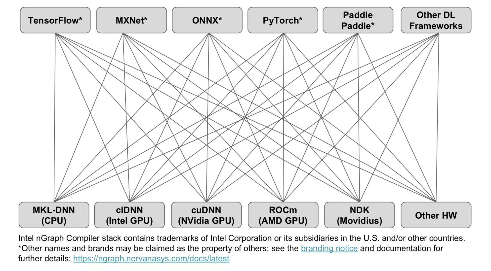
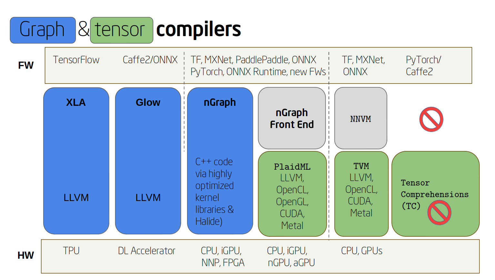
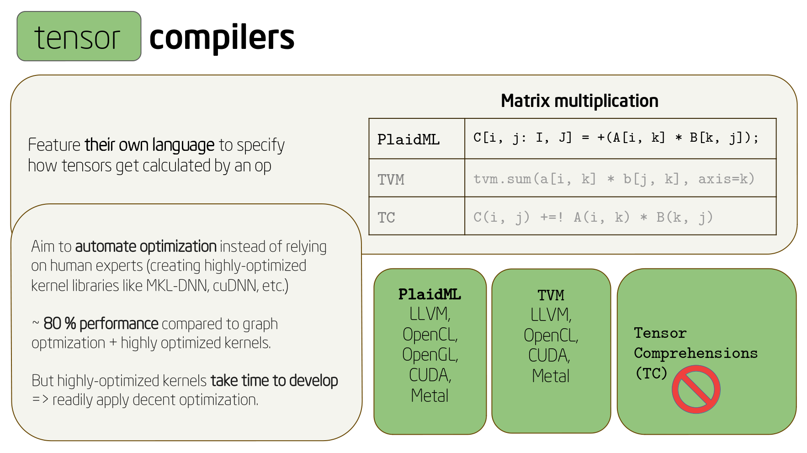

.. introduction:

############
Introduction
############

Accelerating deep learning performance is critical for further development of Artificial Intelligence (AI). Deep learning models & corresponding data set sizes are increasing rapidly, and deployment of scalable AI solution is challenging. Currently, there are two general approaches to advancing deep learning performance. First approach is to design hardware solutions dedicated to deep learning computation. Exisiting large silicon companies including Intel and deep learning hardware startups are actively developing ASICs (Application Specific Integrated Circuit) for speeding up deep learning performance for training & inference. Second approach is to deliever performance via software optimization, and nGraph Compiler stack is our solution to the second apporach. We created nGraph compiler stack not only to provide software acceleration for the upcoming deep learning ASICs but also to unlock massive performance boost for exisiting hardware targets such as CPUs and GPUs. 

Motivations
===========

The current state of art software solution for speeding up deep learning computation is to integrate kernel libraries such as Intel MKL-DNN and NVidia's CuDNN into deep learning frameworks. These kernel libraries offer runtime performance boost on specific hardware targets through highly optimized kernels and operator level optimizations.

However, kernel libraries have three main problems: 

1. Kernel libraries do not support graph level optimizations
2. Framework integration of kernel libraries does not scale
3. There are too many kernels to write and they require expert knowledge 

nGraph Compiler stack is designed to address the first two problems. nGraph applies graph level optimizations by taking computational graph from deep learning frameworks and reconstructing it with nGraph IR (Intermediate Representations). nGraph IR centralizes computational graphs from various frameworks and provides a unified way to connect backends for targetted hardwares. To address the third problem, nGraph Compiler stack is integrated with PlaidML to generate code in LLVM, OpenCL, OpenGL, Cuda and Metal with low level optimizations automatically applied. 

The following three sections explore the aformentioned three problems in more detail. 

1. Absence of graph level optimization
---------------------------------------------------------

The diagram below illustrates a simple example of how a deep learning framework integrated with a kernel library is capable of running each operation in a graph optimally, but the graph itself may not be optimial.  

.. _figure-A:

.. figure:: ../graphics/intro_graph_optimization.png
   :width: 555px
   :alt: 

The graph is constructed to execute (A+B)*C, but we can further optimize the graph to be represented as A*C. From the first graph shown on the left, the operation on the constant B be can be computed at the compile time (known as constant folding), and the graph can be further simplified to the one on the right because the constant has value of zero. Without such graph level optimization, a deep learning framework with kernel libraries will compute all the operations, and the resulting computation will be sub-optimal. 

2. Reduced scalability 
-------------------------

Integrating kernel libraries to frameworks is increasingly becoming non-trivial due growing number of new deep learning accelerators. For each new deep learning accelator, a kernel library must be developed by team of experts which is labor intensive. This labor intensive work is further amplified by the number of frameworks as indicated in the following diagram with orange lines. 

Each individual framework must be manually integrated with each hardware-specific kernel library. Each integration 
is unique to the framework and its set of deep learning operators, its view on 
memory layout, its feature set, etc. Each of these connections, then, represents 
significant work for what will ultimately be a brittle setup that is enormously 
expensive to maintain.    
.. _figure-B:

3. Increasing number of kernels 
---------------------------------------------------------

A typical network is constructed using some kind of language-based API, which 
translates the network or :abbr:`DL (Deep Learning)` model (statically or 
dynamically) into serialized graphs. Those graphs can then passed through a 
compilation process (the *Graph optimization or compilation* step in 
*Figure D* below), where various graph-level optimizations, like constant folding 
or fusion can happen. These processes require unique vendor-provided libraries 
to communicate with a driver (possibly through OpenCL\*, CUDA\*, or SYCL\*), to 
compile and execute an implementation (kernel) for a specific 
:abbr:`Instruction Set Architecture (ISA)`, or :term:`ISA`.

Illustrated below is a simplified DL stack, showing relative complexity of 
each component. Note that optimizing for any one on its own usually requires 
engineering expertise that can be highly specialized to that component, and that 
the terms have been simplified for illustrative purposes. 

.. _figure-D:

.. figure:: ../graphics/components-dl-stack.png
   :width: 700px
   :alt: A simplified DL stack

   Figure D: Components of a DL stack, simplified for illustrative purposes.

There are many deep learning frameworks, each with its own strengths and user 
bases. A setup that is common to many DL practitioners is shown in the 
illustration below.

.. _figure-E:

.. figure:: ../graphics/a-common-stack.png
   :width: 700px
   :alt: A common implementation

   Figure E: A commonly-implemented stack uses TensorFlow\* as the frontend. 
   The input is either optimized via Grappler, or executed directly via TensorFlow. 
   In either case, when targeting an Nvidia\* GPU, cuDNN is called to select an 
   optimal kernel for the operation; cuDNN then relies on CUDA\* or direct access 
   to run code on the target; in this toy example, the target is a V100.

A natural result of this approach is that the framework-level integration of 
kernel libraries does not scale. Rather, each individual framework must be 
manually integrated with each hardware-specific kernel library. Each integration 
is unique to the framework and its set of deep learning operators, its view on 
memory layout, its feature set, etc. Each of these connections, then, represents 
significant work for what will ultimately be a brittle setup that is enormously 
expensive to maintain.    

.. _figure-F:

.. figure:: ../graphics/dl-current-state.png
   :width: 700px
   :alt: Scalability matters

   Figure F: The number of kernels necessary to achieve optimal performance is 
   bounded by the product of the number of chip designs one wishes to support, 
   the number of data types supported, the number of operations, and the 
   cardinality of each parameter for each operation.

In the past, this upper bound was quite limited; however, since the industry is 
shifting toward a more diverse future in terms of deep learning hardware, the 
number of distinct kernels is exploding and will continue to explode.

Get the best of both worlds
---------------------------

Integrating a framework on nGraph can be an attractive option for hardware 
companies trying to design their own deep learning hardware or network architecture. 
Framework integration is non-trivial amount of work, and nGraph automatically 
does much of the heavy lifting. Furthermore, PlaidML can provide a wide range of 
hardware coverage and optimization automatically. Any hardware that supports 
LLVM, OpenCL, OpenGL, CUDA or Metal can be supported automatically with PlaidML 
and nGraph.  

.. _figure-G:

   Figure G: Overview of various graph and tensor compilers.

.. _figure-H:

   Figure H: A closer look at tensor compilers.

Other notable efforts
----------------------

A few other notable efforts in compiler projects include: 

* **TVM** https://github.com/dmlc/tvm
* **XLA** https://developers.googleblog.com/2017/03/xla-tensorflow-compiled.html
* **Glow** https://arxiv.org/pdf/1805.00907.pdf 

