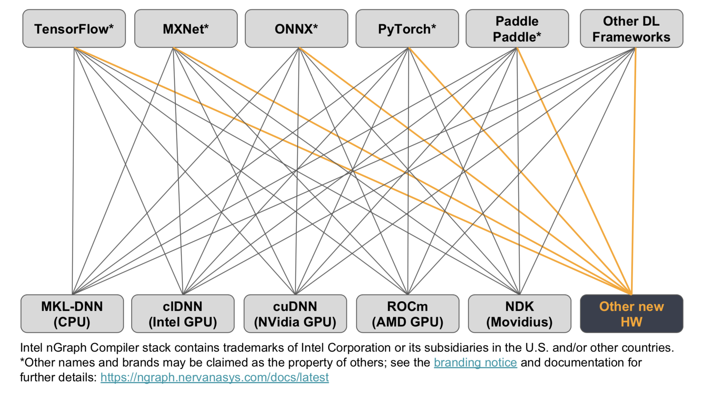
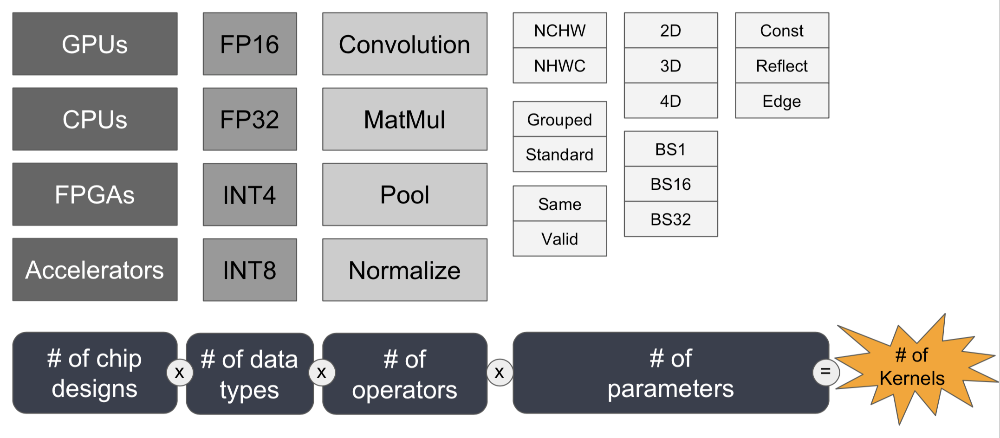

.. introduction:

############
Introduction
############

Accelerating deep learning performance is critical for further development of Artificial Intelligence (AI). Deep learning models & corresponding data set sizes are increasing rapidly, and deployment of scalable AI solution is challenging. Currently, there are two general approaches to advancing deep learning performance. First approach is to design hardware solutions dedicated to deep learning computation. Exisiting large silicon companies including Intel and deep learning hardware startups are actively developing ASICs (Application Specific Integrated Circuit) for speeding up deep learning performance for training & inference. Second approach is to deliever performance via software optimization, and nGraph Compiler stack is our solution to the second apporach. We created nGraph compiler stack not only to provide software acceleration for the upcoming deep learning ASICs but also to unlock massive performance boost for exisiting hardware targets such as CPUs and GPUs. Additionally, it aims to address the scalability issue with kernel libraries which is a popular solution to accelerate deep learning performance at the moment.  

Motivations
===========

The current state of art software solution for speeding up deep learning computation is to integrate kernel libraries such as Intel MKL-DNN and NVidia's CuDNN into deep learning frameworks. These kernel libraries offer runtime performance boost on specific hardware targets through highly optimized kernels and operator level optimizations.

However, kernel libraries have three main problems: 

1. Kernel libraries do not support graph level optimizations
2. Framework integration of kernel libraries does not scale
3. There are too many kernels to write and they require expert knowledge 

nGraph Compiler stack is designed to address the first two problems. nGraph applies graph level optimizations by taking computational graph from deep learning frameworks and reconstructing it with nGraph IR (Intermediate Representations). nGraph IR centralizes computational graphs from various frameworks and provides a unified way to connect backends for targetted hardwares. To address the third problem, nGraph Compiler stack is integrated with PlaidML to generate code in LLVM, OpenCL, OpenGL, Cuda and Metal with low level optimizations automatically applied. 

The following three sections explore the aformentioned three problems in more detail. 

1. Absence of graph level optimization
---------------------------------------------------------

The diagram below illustrates a simple example of how a deep learning framework integrated with a kernel library is capable of running each operation in a graph optimally, but the graph itself may not be optimial.  

.. _figure-A:

.. figure:: ../graphics/intro_graph_optimization.png
   :width: 555px
   :alt: 

The graph is constructed to execute (A+B)*C, but we can further optimize the graph to be represented as A*C. From the first graph shown on the left, the operation on the constant B be can be computed at the compile time (known as constant folding), and the graph can be further simplified to the one on the right because the constant has value of zero. Without such graph level optimizations, a deep learning framework with a kernel library will compute all operations, and the resulting computation will be sub-optimal. 

2. Reduced scalability 
-------------------------

Integrating kernel libraries into frameworks is increasingly becoming non-trivial due to growing number of new deep learning accelerators. For each new deep learning accelator, a kernel library must be developed by team of experts. This labor intensive work is further amplified by the number of frameworks as indicated in the following diagram with orange lines. 

.. _figure-B:

      
Each individual framework must be manually integrated with each hardware-specific kernel library. Each integration 
is unique to the framework and its set of deep learning operators, its view on 
memory layout, its feature set, etc. Each of these connections, then, represents 
significant work for what will ultimately be a brittle setup that is enormously 
expensive to maintain.  

nGraph solves this problem with nGraph bridges that connect to the deep learning frameworks. nGraph bridges take computational graphs from supported deep learning frameworks, and it reconstructs the graph using nGraph IR with a few primitive nGraph operations. With the unified computational graph, kernel libraries no longer need to be separately integrated to each deep learning frameworks. Instead, the libraries only need to support nGraph primitive operations, and this approach streamlines integration process for the backend.  

3. Increasing number of kernels 
---------------------------------------------------------

As mentioned in the pervious section, kernel libraries need to be integrated with multiple deep learning frameworks, and this arduous task becomes even harder due to increased numbers of required kernels for achieving optimial performance. The number of required kernels is product of number of chip designs, data types, operations, and the cardinality of each parameter for each operation. In the past, the number of required kernels was limited, but as the AI research and industry rapidly develops, the final product of required kernels will increase exponentially. 

.. _figure-C:

PlaidML was designed to address the expoential growth of kernel needs. It takes two inputs: operation defined by the user and machine description of the targetted hardware. It utilizes a Domain Specific Language (DSL) called Tile which allows developers to express how an operation should calculate tensors in a intutitive mathematical form. PlaidML takes user defined tile code along with targed machine description such as threads, max memory input, etc to automatically apply low level optimizations. This automated optimization does not require kernel libraries to be written and lifts heavy burden for kernel developers. It also provides flexibility to support newer deep learning models in absence of hand optimized kernels for the new operations.   

Our solution: nGraph & PlaidML
===============================

We developed nGraph and integrated it with PlaidML to accelerate deep learning performance. Furthermore, nGraph aims 

Integrating a framework on nGraph can be an attractive option for hardware 
companies trying to design their own deep learning hardware or network architecture. 
Framework integration is non-trivial amount of work, and nGraph automatically 
does much of the heavy lifting. Furthermore, PlaidML can provide a wide range of 
hardware coverage and optimization automatically. Any hardware that supports 
LLVM, OpenCL, OpenGL, CUDA or Metal can be supported automatically with PlaidML 
and nGraph.  

