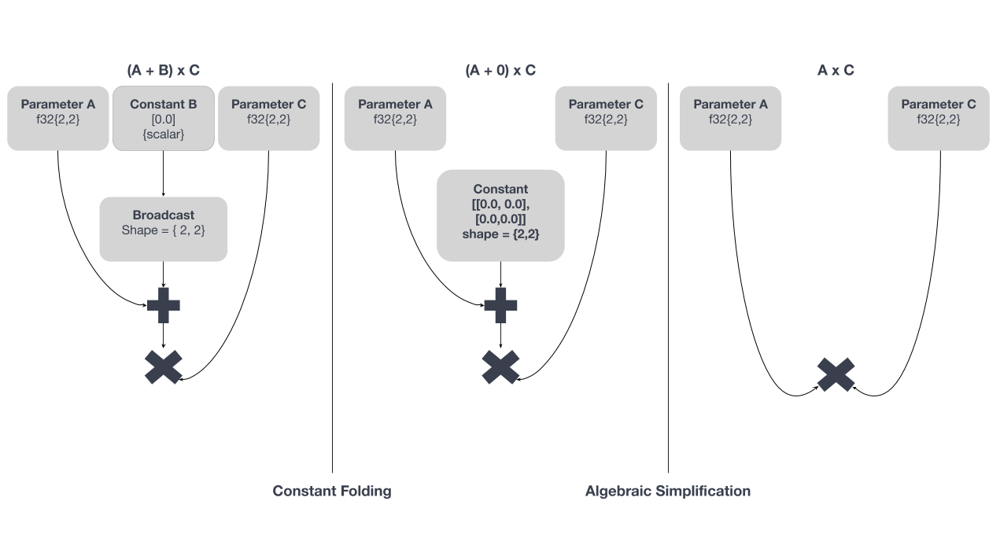
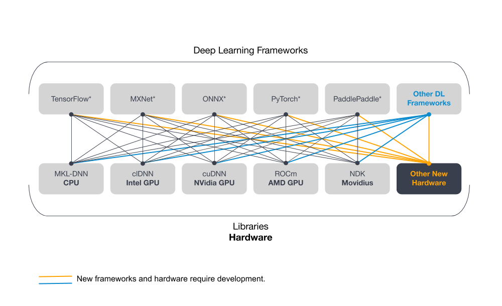
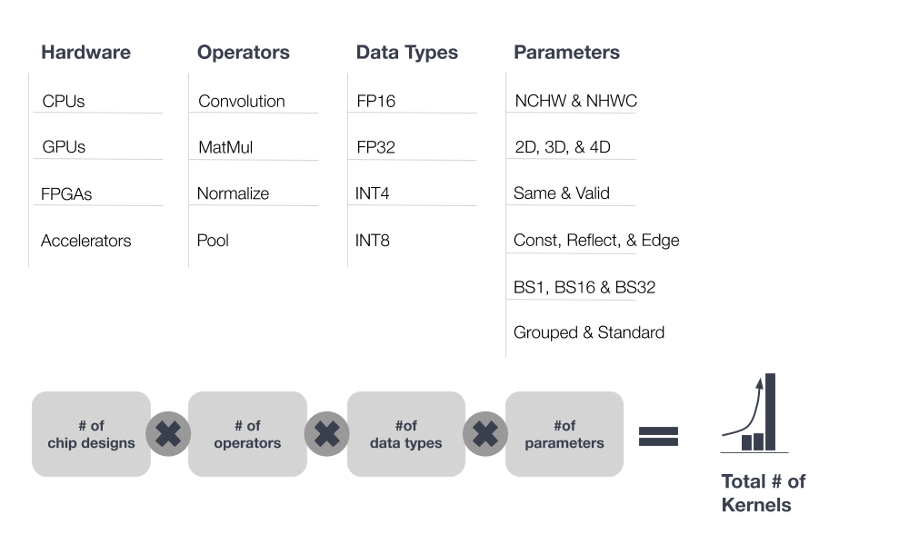

.. project/introduction.rst:

Introduction
############

Future developments in :abbr:`Artificial Intelligence (AI)` will increasingly 
rely on better methods to accelerate the performance of deep learning workloads. 
As :abbr:`Deep Learning (DL)` models become more complex, and as the volume of 
data those models are expected to handle increases rapidly, the deployment of 
scalable AI solutions becomes a greater challenge. 

Today, two standard approaches to accelerate deep learning performance are:

#. **Design hardware solutions dedicated to deep learning computation** -- Many 
   companies, ranging from startups to established manufacturers such as
   Intel, are actively developing :abbr:`Application Specific Integrated Circuits (ASICs)`
   to accelerate the performance of deep learning for both training and 
   inference.

#. **Optimize software to accelerate performance** -- nGraph Compiler, an 
   open-source deep learning compiler, is Intel's solution to deliver performance 
   via software optimization. nGraph provides developers with a way to 
   accelerate workloads via software and to provide a significant increase 
   in performance for standard hardware targets such as CPUs and GPUs. For 
   deploying scalable AI solutions, nGraph uses kernel libraries, a popular 
   and effective method to improve deep learning performance. Where kernel 
   libraries are available and perform well, we use them.

Motivations 
===========

The current :abbr:`State-of-the-Art (SoTA)` software solution for deep 
learning computation is to integrate kernel libraries such as Intel® 
:abbr:`Math Kernel Library for Deep Neural Networks (Intel® MKL DNN)` 
and Nvidia\*'s CuDNN into deep learning frameworks. These kernel 
libraries offer a performance boost during runtime on specific hardware 
targets through highly-optimized kernels and other operator-level 
optimizations.

However, kernel libraries have three main problems:

#. Kernel libraries do not support graph-level optimizations. 
#. Framework integration of kernel libraries does not scale. 
#. The number of required kernels keeps growing.

nGraph Compiler addresses the first two problems, and nGraph Compiler combined
with PlaidML addresses the third problem. nGraph applies graph-level
optimizations by taking the computational graph from a deep learning framework
such as TensorFlow\* and reconstructing it with nGraph's  
:abbr: `IR (Intermediate Representation)`. nGraph IR centralizes computational 
graphs from various frameworks and provides a unified way to connect backends 
for targeted hardware. To address the third problem, nGraph is integrated with 
PlaidML, a tensor compiler, which generates code in LLVM, OpenCL, OpenGL, and 
Metal. Low-level optimizations are automatically applied to the generated code, 
resulting in a more efficient execution that does not require manual kernel 
integration for most hardware targets.

The following three sections explore the main problems of kernel libraries in
more detail and describe how nGraph addresses them.

Problem 1: Kernel libraries do not support graph-level optimizations
--------------------------------------------------------------------

The example diagrams below shows how a deep learning framework, when integrated
with a kernel library, can optimally run each operation in a computational
graph, but the choice of operations in the graph may not be optimal.

.. _figure-A:

The computation is constructed to execute ``(A+B)*C``. With nGraph, we can
further optimize the graph to be represented as ``A*C``. From the first graph
shown on the left, the operation on the constant ``B`` can be computed at
compile time (an optimization known as *constant folding*). The graph can be
further simplified to the one on the right because the constant has a value of
zero (known as *algebraic simplification*). Without such graph-level
optimizations, a deep learning framework with a kernel library will compute
all operations, resulting in suboptimal execution.

Problem 2: Framework integration of kernel libraries does not scale
-------------------------------------------------------------------

Due to the growing number of new deep learning accelerators, integrating
kernel libraries with frameworks has become increasingly more difficult. For
each new deep learning accelerator, a custom kernel library integration must
be implemented by a team of experts. This labor-intensive work is further
complicated by the number of frameworks, as illustrated in the following
diagram.

.. _figure-B:

Each framework must be manually integrated with each hardware-specific kernel
library. Additionally, each integration is unique to the framework and its set
of deep learning operators, view on memory layout, feature set, etc. Each
connection that needs to be made increases the amount of work, resulting in a
fragile setup that is costly to maintain.

nGraph solves this problem with bridges. A bridge takes a computational
graph or similar structure and reconstructs it in the nGraph IR along with a
few primitive nGraph operations. With a unified computational graph, kernel
libraries no longer need to be separately integrated into each deep learning
framework. Instead, the libraries only need to support nGraph primitive
operations, and this approach streamlines the integration process for the
backend.

Problem 3: The number of required kernels keeps growing
-------------------------------------------------------

Integrating kernel libraries with multiple deep learning frameworks is a
difficult task that becomes more complex with the growing number of
kernels needed to achieve optimal performance. Past deep learning research has
been built on a small set of standard computational primitives (convolution,
GEMM, etc.). But as AI research advances and industrial deep learning
applications continue to develop, the number of required kernels continues to
increase exponentially. The number of required kernels is based on the number
of chip designs, data types, operations, and the cardinality of each parameter
per operation. Each connection in the following diagram represents significant 
work for what will ultimately be a fragile setup that is costly to maintain.

.. _figure-C:

Integrating PlaidML with nGraph provides flexbility to support the latest deep
learning models in the absence of hand-optimized kernels for new operations.
PlaidML works together with nGraph to address the exponential growth of
kernels.

PlaidML takes two inputs: the operation defined by the user and the machine
description of the hardware target. It then automatically generates kernels
that are iteratively optimized through an IR known as `Stripe`_. Integration of
PlaidML with nGraph allows users to choose the hardware and framework that
suits their needs, resulting in freedom from kernel libraries. 

Solution: nGraph and PlaidML
============================

We developed nGraph and integrated it with PlaidML to allow developers to
accelerate deep learning performance and address the problem of scalable
kernel libraries. To address the problem of scaling backends, nGraph applies 
graph-level optimizations to deep learning computations and unifies 
computational graphsfrom deep learning frameworks with nGraph IR.

In conjunction with nGraph's graph-level optimizations, PlaidML automatically
applies low-level optimizations to improve deep learning performance.
Additionally, PlaidML offers extensive support for various hardware targets
due to its abilility to generate code in LLVM, OpenCL, OpenGL, and Metal.

Given a backend with existing kernel libraries, nGraph can readily support the
target hardware because the backend only needs to support a few primitive
operations. If the hardware supports one of the coding languages supported by
PlaidML, developers must specify the machine description to support the
hardware. Together, nGraph and PlaidML provide the best of both worlds.

This documentation provides technical details of nGraph's core functionality
as well as framework and backend integrations. Creating a compiler stack like
nGraph and PlaidML requires expert knowledge, and we're confident that nGraph
and PlaidML will make life easier for many kinds of developers:

#. Framework owners looking to support new hardware and custom chips.
#. Data scientists and ML developers wishing to accelerate deep learning
   performance.
#. New DL accelerator developers creating an end-to-end software stack from a
   deep learning framework to their silicon.

.. _Stripe: https://arxiv.org/abs/1903.06498
.. _publication: https://arxiv.org/abs/1801.08058
.. _up to 45X: https://ai.intel.com/ngraph-compiler-stack-beta-release/
.. _more transistors on denser and denser circuits: https://www.intel.com/content/www/us/en/silicon-innovations/moores-law-technology.html
