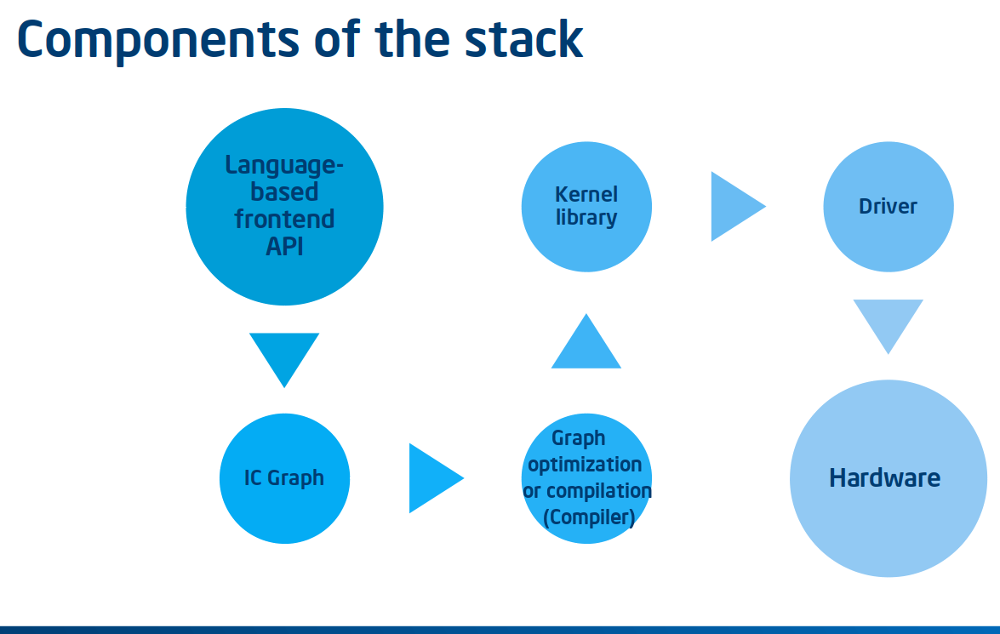
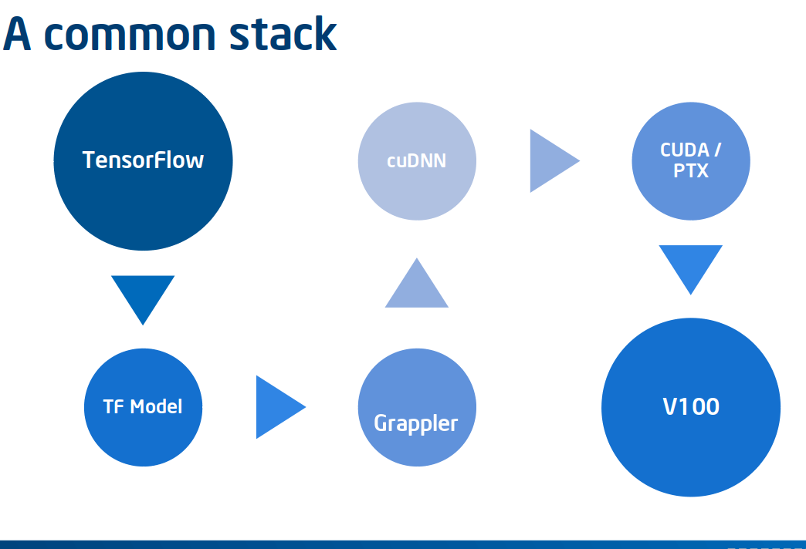
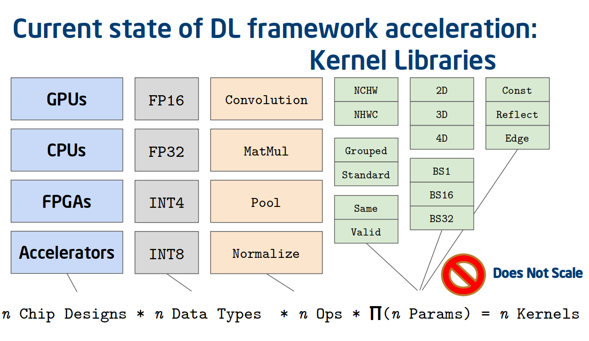

.. introduction:

############
Introduction
############

The nGraph Compiler stack provides an industry-standard reference for working
with various :abbr:`Deep Learning (DL)` (DL) models and optimizing an 
:abbr:`Artificial Neural Network`, or :term:`ANN` to run a particular DL model 
for training and inference. Having such a standard simplifies what would 
otherwise be an enormously complex and difficult-to-scale pipeline 
(:ref:`Figure 1 <figure-1>`) from "training with your favorite framework on GPU" 
(:ref:`Figure 2 <figure-2>`) to deploying that pre-trained model in a datacenter 
or production environment, where both hardware owners and software developers 
are concerned with **efficiency per-watt**, to keep costs in check.

A typical network is constructed using some kind of language-based API, which 
translates the network or DL model -- either statically or dynamically -- into 
serialized graphs that can be used for interchange. Those graphs can then passed 
through  a compilation process (the *Graph optimizer or compilation* step in 
*Figure 1*), which performs various graph-level optimizations, like constant 
folding or fusion. These processes most often require some kind of vendor-provided 
kernel library, which communicates with a driver (possibly through OpenCL\*, 
CUDA\*, or SYCL\*), to compile and execute an implementation (kernel) for a 
specific :abbr:`Instruction Set Architecture (ISA)`, or :term:`ISA`.

Illustrated below is a simplified DL stack, showing relative complexity of 
each component around the graph compilation phase or process. Note that each 
component also requires specialists unique to that component (that is: data 
scientists or people working with a frontend API often don't know or care 
what is happening at the kernel level or "under the hood".)

.. _figure-1:

   Figure 1: Components of a DL stack, simplified for illustrative purposes.

There are many deep learning frameworks, each with its own strengths and 
user bases.

.. _figure-2:

   Figure 2: A commonly-implemented stack uses TensorFlow as the frontend. A 
   resultant TF Model is either optimized by XLA via Grappler, or executed 
   directly via TensorFlow. In either case, when targeting an Nvidia\* GPU, 
   cuDNN is called to select an optimal kernel for the operation; cuDNN then 
   relies on CUDA\* or direct access to run code on the target, in this case 
   a V100.

The natural result of this approach is that the framework-level integration of 
kernel libraries does not scale. Rather, each individual framework must be 
manually integrated with each hardware-specific kernel library. Each integration 
is unique to the framework and its set of deep learning operators, its view on 
memory layout, its feature set, etc. Each of these connections, then, represents 
significant work for what will ultimately be a brittle setup in the long term, 
if any component on either end changes.  

.. _figure-3:

   The number of kernels necessary to achieve optimal performance is bounded by 
   the product of the number of chip designs one wishes to support, the number 
   of data types supported, the number of operations, and the cardinality of 
   each parameter for each operation.

In the past, this upper bound was quite limited; however, the industry is 
shifting toward a more diverse future in terms of deep learning hardware, 
meaning the number of distinct kernels is exploding and will continue to explode.
