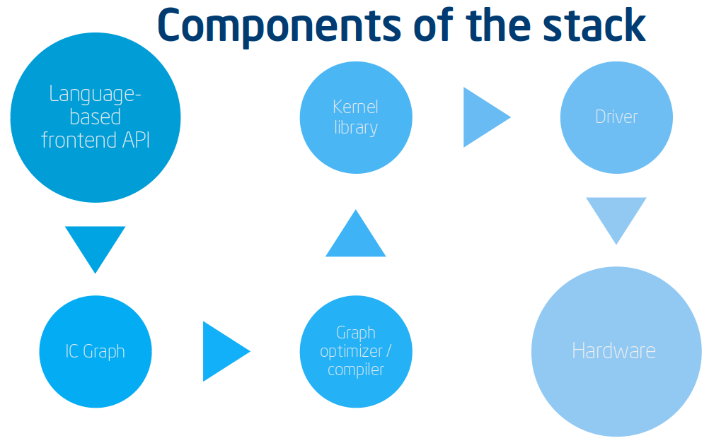

.. introduction:

############
Introduction
############

The nGraph Compiler stack provides industry-standard reference and implementation 
guidelines for working with various :abbr:`Deep Learning (DL)` (DL) models and 
optimizing an :abbr:`Artificial Neural Network (ANN)` (often abbreviated :term:`NN`) 
to run graph-based computations for training, inference, testing, or validation.  
Today's NNs make use of many new and novel devices, ranging in complexity from a 
simple FPGA to a custom hardware accelerators. Having such a standard simplifies 
what would otherwise be an enormously complex and difficult-to-scale pipeline 
(:ref:`Figure 1 <figure-1>`) from "training with your favorite framework 
using GPUs" (:ref:`Figure 2 <figure-2>`), to deploying that now pre-trained 
model in a datacenter or production environment, where infrastructure owners and  
software developers renting anything in a datacenter are mutually concerned with 
**efficiency per-watt**, to keep costs in check.

So what exactly are the motivations behind the nGraph Compiler stack? 

Kernel libraries do not support graph-level optimizations
---------------------------------------------------------

A framework designed for training using GPUs requires integration with a kernel 
library unique to that vendor's hardware. For example, after integration, a 
kernel library can run a "familar" graph optimally; however, the graph itself 
on the larger :term:`NN` is not optimal.   

.. _figure-0:

   Figure 0: Lack of graph-level optimization makes framework-to-kernel library
   integration enormously inefficient. The computation graph here represents 
   "quantity A plus B times C".

.. _figure-1:

   Figure 1: Lack of graph-level optimization makes framework-to-kernel library
   integration enormously inefficient. The graph represents quantity A plus B 
   times C

.. _figure-2:

   Figure 2: Lack of graph-level optimization makes framework-to-kernel library
   integration enormously inefficient. The graph represents quantity A plus B 
   times C

First, we notice that an operation on the constant B (in this case a broadcast) can be done at compile time.  This is constant folding.
[[click]]

Then, we notice that the constant has value zero thus the add is an identity operation and can be eliminated.  This is algebraic simplification.
[[click]]

Now we have an optimal graph.  A times C.
Again, kernel ibraries do not support this type of optimization.

A typical network is constructed using some kind of language-based API, which 
translates the network or :abbr:`DL (Deep Learning)` model (statically or 
dynamically) into serialized graphs. Those graphs can then passed through a 
compilation process (the *Graph optimization or compilation* step in 
*Figure 1*), where various graph-level optimizations, like constant folding 
or fusion can happen. These processes most often require some kind of vendor-
provided kernel library, which communicates with a driver (possibly through 
OpenCL\*, CUDA\*, or SYCL\*), to compile and execute an implementation 
(kernel) for a specific :abbr:`Instruction Set Architecture (ISA)`, or 
:term:`ISA`.

At a glance, the illustration below shows the various graph compilers and 
tensor compiler tools available today. Graph compilers are indicated in blue, 
and tensor compilers in green.

Illustrated below is a simplified DL stack, showing relative complexity of 
each component around the graph compilation phase or process. Note that each 
component often requires specialists unique to that component, and that the
terms have been simplified for illustrative purposes. 

.. _figure-3:

   Figure 3: Components of a DL stack, simplified for illustrative purposes.

There are many deep learning frameworks, each with its own strengths and 
user bases. A setup that is common to many DL practitioners is shown below.

.. _figure-4:

.. figure:: ../graphics/a-common-stack.png
   :width: 700px
   :alt: A common implementation

   Figure 4: A commonly-implemented stack uses TensorFlow\* as the frontend. 
   The input is either optimized via Grappler, or executed 
   directly via TensorFlow. In either case, when targeting an Nvidia\* GPU, 
   cuDNN is called to select an optimal kernel for the operation; cuDNN then 
   relies on CUDA\* or direct access to run code on the target; in this example, 
   a V100.

The natural result of this approach is that the framework-level integration of 
kernel libraries does not scale. Rather, each individual framework must be 
manually integrated with each hardware-specific kernel library. Each integration 
is unique to the framework and its set of deep learning operators, its view on 
memory layout, its feature set, etc. Each of these connections, then, represents 
significant work for what will ultimately be a brittle setup that is enormously 
expensive to maintain.    

.. _figure-5:

.. figure:: ../graphics/dl-current-state.png
   :width: 700px
   :alt: Scalability matters

   Figure 5: The number of kernels necessary to achieve optimal performance is 
   bounded by the product of the number of chip designs one wishes to support, 
   the number of data types supported, the number of operations, and the 
   cardinality of each parameter for each operation.

In the past, this upper bound was quite limited; however, the industry is 
shifting toward a more diverse future in terms of deep learning hardware, 
meaning the number of distinct kernels is exploding and will continue to 
explode.

Get the best of both worlds
---------------------------

Integrating a framework on nGraph can be an attractive option for hardware 
companies trying to design their own deep learning hardware or network architecture. 
Framework integration is non-trivial amount of work, and can do much of the 
heavy lifting. Furthermore, PlaidML can provide a wide range of hardware coverage 
and optimization automatically. Any hardware that supports LLVM, OpenCL, OpenGL, 
CUDA or Metal can be supported automatically with PlaidML and nGraph.  

.. _figure-6:

   Figure 6: Overview of various graph and tensor compilers.

.. _figure-6:

   Figure 6: A closer look at tensor compilers.

