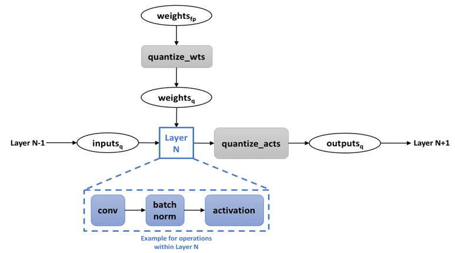

.. quantize/overview.rst:

.. _quantization: 

Overview
########

.. contents::

Post-Training Quantization (PTQ)
================================

:abbr:`Post-Training Quantization (PTQ)` (PTQ) refers to a technique that 
accepts a standard trained :abbr:`Neural Network (NN)` model (usually in 
float single-precision ``fp32``), takes a representative set of input data 
referred to as a "Calibration Set", gathers statistics to acquire minimum 
and maximum values, and then matches those ranges to the ``INT8/UINT`` 
range.

Methods
-------

GemmLowP 
~~~~~~~~

The term "GemmLowP" was coined by Google[1]_ from its `low precision math library`_, 
and it denotes a basic formula of quantization in the form of:

``float`` = :math:`Scale` (*quantized* - ``zero_point``)

where:

- ``float`` is a float scale value,
- *quantized* is the quantized value (INT8 or UINT8), and
- ``zero_point`` is the integer number that represents zero (``INT8`` or ``UINT8``), 
  also named as "offset".

We denote a superscript lower-case 'f' for float: and 'i' for integer; the 
lower-case 'x' subscript is the constant the scale of offset refers to.

If we assume that zero is always in the representable range, then the
type of the _____ must be the same as the type of the quantized value: ``INT8`` 
or ``UINT8``.

SymLowP
~~~~~~~

We use the term :abbr:`SymLowP (SymLP)` to denote that the range is symmetric; 
that is, the type is ``INT8`` and the ``zero_point`` offset is zero. To diffuse 
the confusion between INT vs UINT and SymLP vs GEMMLP, keep in mind that 
SymLP is commonly ``INT8`` with zero ``zero_point``, while GEMMLP is ``UINT8``. 
In some instances, (after ReLU, for example) we see ``UINT8`` with zero offset 
since the values are always positive. This special case is important because
while the zero point is zero, it is still considered GemmLP. For the purpose 
of this documentation, we use the term SymLP for *any* zero zero_point, regardless 
of the data type, even when it is not symmetric.

Pros and Cons
-------------

When using zero zero_point, many calculations become simpler. For
example, consider the element-size operation of Mul (multiplication): Y
= :math:`X` :sub:`1 `\ \* :math:`X` :sub:`2`

In GemmLP, considerable work is necessary, while in SymLP, all offsets are zero.

In cases where the range of values is not symmetric, quantization values
on an unused range are very costly; the GemmLP approach yields better
expected accuracy at a cost.

+------------------+-----------------+-------------------+------------------+
| **Network**      | **Top1 - FP32** | **Top1 - GemmLP** | **Top1 - SymLP** |
+------------------+-----------------+-------------------+------------------+
| **Inception V1** | 68.067          | 67.273            | 66.969           |
+------------------+-----------------+-------------------+------------------+
| **NCF**          | 63.185          | 62.473            | 60.463           |
+------------------+-----------------+-------------------+------------------+
| **Resnet 50**    | 75.162          | 75.154            | 75.002           |
+------------------+-----------------+-------------------+------------------+

*Source: NNP-I Validation System*

Per-Channel Quantization (PCQ)
------------------------------

When dealing with 2D convolutions, sometimes each channel (feature map)
has its own range. When you come across this scenario, sometimes it is
also necessary to define a scale and offset per channel/feature-map.

The convolution weights/filters, however, are 4D tensors, with a filter
mask per input channel and per output channel. For computational
simplification, a scale-per-output filter mask (such as the same scale
for all filters of all input channels) in many cases is enough to
achieve decent results.

To apply different scale-per-input and output channel, adjust weights
to compensate; simply combine *Equation 1* with *Equation 4* to form
a new equation:

*Combined equations*

Now we can define *input-compensated weights* with the following
simplification:

*Simplified equation*

Assuming only different scale per-output channel is needed:

*Solved*

Convolution weights and filters, however, are 4D Tensors, with a filter
mask per input channel and per output channel. For computational
simplification, a scale-per-output filter mask (such as the same scale
for all filters of all input channels) in many cases is enough to
achieve decent results.

How to find the correct scale and offset?
-----------------------------------------

By choosing the data type: ``INT8`` vs ``UINT8``, and the ``scale`` and 
``offset``, the dynamic range is implied as a Minimum and Maximum value. 
Using ``UINT8``, for example, implies:

:: 
   
   Maximum = scale \* (255 – zero_point)
   Minimum = -scale \* (zero_point)

Many techniques may be used; they are all based on running a calibration
set and gathering the appropriate statistics. If we take the *absolute*
maximum from all images, a larger scale may take some outliers that will
forcibly increase the range and thus reduce accuracy.

Several post-training quantization techniques vary only in the ways
those Min and Max ranges are found. An effective approach being used in
`Distiller`_ is one that uses the AVG + n \* STD where you sample the maximum value of a
tensor, given an input data; then from those results, take the Average :math:`n` 
times the *standard deviation*, assuming the distribution of the maximum and 
minimum values is Gaussian.

Advantages and disadvantages
----------------------------

The post-training quantization method is fairly simple and fast,
requiring merely the original model and some calibration data; however,
in many cases, the accuracy achieved is less than Quantization-Aware
Training (QAT), discussed in the next section.

The primary advantage of post-training quantization is that the training
process itself is not sensitive to hardware or to the degree of
inference precision available; train once and run anywhere.

Existing Tools and APIs for PTQ
-------------------------------

From Intel
~~~~~~~~~~

Today Intel provides two tools for post-training quantization:
 
#. `Distiller`_  is an open-source Python package for neural network
   compression research. Network compression can reduce the footprint of
   a neural network, increase its inference speed, and save energy.
   Distiller provides a `PyTorch <http://pytorch.org/>`__ environment
   for prototyping and analyzing compression algorithms, such as
   sparsity-inducing methods and low precision arithmetic. It also
   contains:

   a) A framework for integrating pruning, regularization and
      quantization algorithms.
   b) A set of tools for analyzing and evaluating compression
      performance.
   c) Example implementations of State-of-the-Art (SotA) algorithms.

#. `Inference Engine Calibration Tool`_ included as part of the OpenVINO 
   Toolkit calibrates a given FP32 model so that it can be run in 
   low-precision 8-bit integer mode while keeping the input data of this 
   model in the original precision.

#. Early-stage API support for the :doc:`../ops/quantize` and 
   :doc:`../ops/dequantize` ``Ops``.

TensorFlow Lite
~~~~~~~~~~~~~~~

For post-training quantization, only TensorFlow\* Lite currently offers:
https://www.tensorflow.org/lite/performance/post_training_quantization

Quantization-Aware Training (QAT)
=================================

Quantization-Aware Training is a technique used to quantize models during 
the training process. The main idea is that the quantization is emulated 
in the forward path by inserting *Quantization* and *De-Quantization* 
nodes (Q-DQ) several places in the network to emulate the inference 
quantization noise. The expectation is the backward propagation will 
alter the weights so that they will adapt to this noise and the result 
loss will be much better than the traditional Post-Training Quantization.

   A layer with Q-DQ  Source: `Distiller`_ 

For the weights, it is also common to take different quantization
functions that cut off outliers, such asDoReFa, PACT and WRP. You can
read all about them in the `Distiller guide`_.

Sensitivity to Hardware
-----------------------

When using QAT techniques, the position in which the Q-DQ ops are placed
needs to align with the fusions hardware does underneath the hood in
inference. In *Figure 2*, you can see that the Conv, BatchNorm and
Activation are all fused into "Layer"; this is because BatchNorm is
folded into the Conv weights, and many implementations automatically
fuse convolution and activations. Proper implementation should
synchronize the fusions the HW does and place the Q-DQ in the proper
place.

Existing Tools
--------------

Intel's QAT Tool
~~~~~~~~~~~~~~~~

Intel provides (as experimental) a tool that takes a model that has been
trained to some extent and places Q-DQ ops in the appropriate places.
The tool is not widely distributed yet.

In TensorFlow
~~~~~~~~~~~~~

In TensorFlow, one can manually put Fake Quantization nodes to do the
QAT using Q-DQ ops.

How to deploy on the Intel® Nervana™ NNP-I
==========================================

The software stack of the Intel® Nervana™ NNP-I accelerators is provided
as a backend for the following frameworks:

-  **TensorFlow**- provided as an nGraph backend, please refer to the
   `ngraph-bridge`_ 
   installation and configuration instructions.
-  **PyTorch**- Provided as a GLOW backend, please refer to Glow for
   instructions on installation and configuration.
-  **OpenVINO**- Provided as an OpenVINO backend, tentatively scheduled
   to be available in early 2020.

.. _ngraph-bridge: https://github.com/tensorflow/ngraph-bridge
.. _low precision math library: https://github.com/google/gemmlowp/blob/master/doc/quantization.md
.. _Distiller: https://nervanasystems.github.io/distiller/index.html
.. _Distiller guide: https://nervanasystems.github.io/distiller/algo_quantization.html#quantization-aware-training
.. _Inference Engine Calibration Tool: http://docs.openvinotoolkit.org/2019_R1/_inference_engine_samples_calibration_tool_README.html